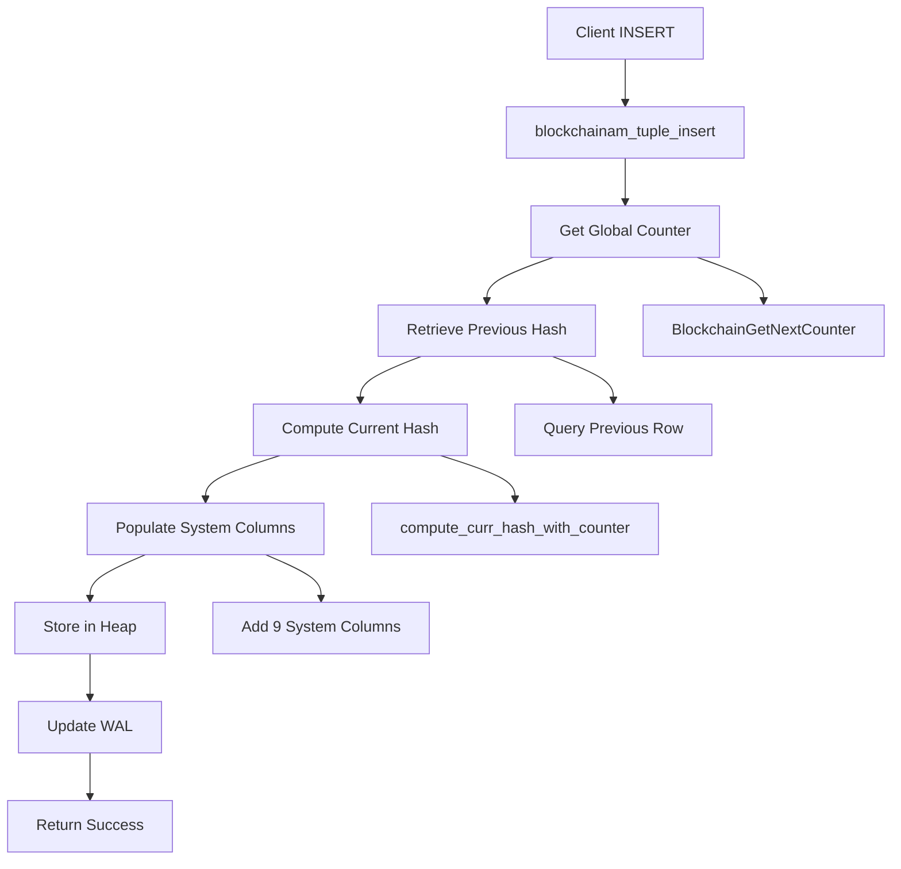

# Blockchain Table Access Method Architecture

## Overview

The Blockchain Table Access Method (TAM) is the core component that implements immutable, tamper-evident storage in PostgreSQL. It extends PostgreSQL's pluggable table access method interface to provide blockchain-specific storage semantics.

## File Structure

```
src/backend/access/blockchain/
├── blockchainam.c          # Main TAM implementation (3,630 lines)
├── blockchain_hash.c       # Hash computation engine (1,065 lines)
├── blockchain_counter.c    # Global counter system (594 lines)
├── blockchain_utility.c    # DDL protection hooks (121 lines)
└── blockchain_anchor.c     # Anchor functionality (131 lines)

src/include/blockchain/
├── blockchainam.h          # TAM interface definitions
├── blockchain_hash.h       # Hash function declarations
└── blockchain_counter.h    # Counter system interface
```

## Table Access Method Interface

### Core TAM Functions

The blockchain TAM implements all required TableAM interface functions:

```c
// Primary TAM interface structure
const TableAmRoutine blockchainam_methods = {
    .type = T_TableAmRoutine,
    
    // Slot operations
    .slot_callbacks = blockchainam_slot_callbacks,
    
    // Tuple operations
    .tuple_insert = blockchainam_tuple_insert,
    .tuple_insert_speculative = blockchainam_tuple_insert_speculative,
    .tuple_complete_speculative = blockchainam_tuple_complete_speculative,
    .tuple_delete = blockchainam_tuple_delete,        // Always fails
    .tuple_update = blockchainam_tuple_update,        // Always fails
    .tuple_lock = blockchainam_tuple_lock,
    .tuple_fetch_row_version = blockchainam_tuple_fetch_row_version,
    .tuple_get_latest_tid = blockchainam_tuple_get_latest_tid,
    .tuple_tid_valid = blockchainam_tuple_tid_valid,
    .tuple_satisfies_snapshot = blockchainam_tuple_satisfies_snapshot,
    
    // Scan operations
    .scan_begin = blockchainam_scan_begin,
    .scan_end = blockchainam_scan_end,
    .scan_rescan = blockchainam_scan_rescan,
    .scan_getnextslot = blockchainam_scan_getnextslot,
    .scan_getnextslot_tidrange = blockchainam_scan_getnextslot_tidrange,
    .scan_set_tidrange = blockchainam_scan_set_tidrange,
    .scan_getnextslot_sampling = blockchainam_scan_getnextslot_sampling,
    
    // ... additional interface methods
};
```

### Immutability Enforcement

#### Update and Delete Prevention

```c
static TM_Result
blockchainam_tuple_delete(Relation rel, ItemPointer tid,
                         CommandId cid, Snapshot snapshot,
                         Snapshot crosscheck, bool wait,
                         TM_FailureData *tmfd, bool changingPart)
{
    ereport(ERROR,
            (errcode(ERRCODE_FEATURE_NOT_SUPPORTED),
             errmsg("DELETE is not supported on blockchain tables"),
             errdetail("Blockchain tables are immutable")));
    
    return TM_Deleted; /* Never reached */
}

static TM_Result
blockchainam_tuple_update(Relation rel, ItemPointer otid,
                         TupleTableSlot *slot, CommandId cid,
                         Snapshot snapshot, Snapshot crosscheck,
                         bool wait, TM_FailureData *tmfd,
                         LockTupleMode *lockmode, TM_UpdateFailureData *updatefail)
{
    ereport(ERROR,
            (errcode(ERRCODE_FEATURE_NOT_SUPPORTED),
             errmsg("UPDATE is not supported on blockchain tables"),
             errdetail("Blockchain tables are immutable")));
    
    return TM_Updated; /* Never reached */
}
```

## System Column Management

### System Column Definitions

The blockchain TAM automatically adds nine system columns to every blockchain table:

```c
static BlockchainColumnDef blockchain_system_columns[] = {
    {"__row_id", UUIDOID, -1, -1},              // Unique row identifier
    {"__curr_hash", BYTEAOID, -1, -1},          // Current row hash (SHA-256)
    {"__prev_hash", BYTEAOID, -1, -1},          // Previous row hash
    {"__tx_type", TEXTOID, -1, -1},             // Transaction type (always 'INSERT')
    {"__tx_lsn", INT8OID, -1, -1},              // Global counter value
    {"__tx_origin", UUIDOID, -1, -1},           // Transaction origin identifier
    {"__tx_version", INT4OID, -1, -1},          // Row version (always 1)
    {"__is_latest", BOOLOID, -1, -1},           // Latest flag (always true)
    {"__tx_timestamp", TIMESTAMPTZOID, -1, -1}  // Transaction timestamp
};

#define NUM_BLOCKCHAIN_COLUMNS 9
```

### Column Population Process

#### Insert Operation Column Management

```c
static void
populate_blockchain_system_columns(TupleTableSlot *slot, Relation rel,
                                  uint64 counter, bytea *curr_hash,
                                  bytea *prev_hash, TimestampTz timestamp)
{
    /* Generate unique row ID */
    Datum row_id = generate_uuid();
    
    /* Set system column values */
    slot_set_system_value(slot, "__row_id", row_id);
    slot_set_system_value(slot, "__curr_hash", PointerGetDatum(curr_hash));
    slot_set_system_value(slot, "__prev_hash", PointerGetDatum(prev_hash));
    slot_set_system_value(slot, "__tx_type", CStringGetTextDatum("INSERT"));
    slot_set_system_value(slot, "__tx_lsn", Int64GetDatum(counter));
    slot_set_system_value(slot, "__tx_origin", generate_uuid());
    slot_set_system_value(slot, "__tx_version", Int32GetDatum(1));
    slot_set_system_value(slot, "__is_latest", BoolGetDatum(true));
    slot_set_system_value(slot, "__tx_timestamp", TimestampTzGetDatum(timestamp));
}
```

## Insert Operation Flow

### Complete Insert Process



### Detailed Implementation

```c
static void
blockchainam_tuple_insert(Relation relation, TupleTableSlot *slot,
                         CommandId cid, int options,
                         BulkInsertState bistate)
{
    TimestampTz timestamp = GetCurrentTimestamp();
    uint64 counter;
    bytea *prev_hash = NULL;
    bytea *curr_hash = NULL;
    
    /* Step 1: Get next global counter */
    counter = BlockchainGetNextCounter(RelationGetRelid(relation));
    
    /* Step 2: Get previous hash from last row */
    prev_hash = get_previous_hash(relation);
    
    /* Step 3: Compute current hash */
    curr_hash = compute_curr_hash_with_counter(relation, slot,
                                              timestamp, prev_hash, counter);
    
    /* Step 4: Populate system columns */
    populate_blockchain_system_columns(slot, relation, counter,
                                      curr_hash, prev_hash, timestamp);
    
    /* Step 5: Insert into heap storage */
    heap_tuple_insert_with_blockchain_metadata(relation, slot, cid, options, bistate);
    
    /* Step 6: Update statistics */
    update_blockchain_statistics(relation);
}
```

## Hash Chain Integration

### Previous Hash Retrieval

The system must efficiently retrieve the hash from the most recently inserted row:

```c
static bytea *
get_previous_hash(Relation rel)
{
    bytea *prev_hash = NULL;
    uint64 max_counter;
    
    /* Use optimized MAX() query instead of ORDER BY for better performance */
    max_counter = get_max_counter_from_table(rel);
    
    if (max_counter == 0) {
        /* First row - return zero hash */
        prev_hash = create_zero_hash();
    } else {
        /* Get hash from row with max counter */
        prev_hash = get_hash_by_counter(rel, max_counter);
    }
    
    return prev_hash;
}
```

### Performance Optimization

The implementation was optimized to use `MAX(__tx_lsn)` instead of `ORDER BY __tx_lsn DESC LIMIT 1` to avoid unnecessary sorting overhead:

```c
/*
 * Performance improvement: O(n) MAX() operation instead of O(n log n) sort
 * This is particularly important since blockchain tables cannot have indexes
 */
static uint64
get_max_counter_efficiently(Relation rel)
{
    /* Implementation using direct MAX() aggregate function */
    return execute_max_counter_query(rel);
}
```

## Scan Operations

### Sequential Scan Implementation

Blockchain tables only support sequential scans due to the prohibition on indexes:

```c
static TableScanDesc
blockchainam_scan_begin(Relation relation, Snapshot snapshot,
                       int nkeys, ScanKey key,
                       ParallelTableScanDesc parallel_scan,
                       uint32 flags)
{
    /* Initialize scan descriptor */
    TableScanDesc scan = palloc0(sizeof(TableScanDescData));
    
    scan->rs_rd = relation;
    scan->rs_snapshot = snapshot;
    scan->rs_nkeys = nkeys;
    scan->rs_key = key;
    scan->rs_flags = flags;
    
    /* Initialize blockchain-specific scan state */
    init_blockchain_scan_state(scan);
    
    return scan;
}
```

### System Column Filtering

During scans, system columns are filtered based on query requirements:

```c
static bool
blockchainam_scan_getnextslot(TableScanDesc sscan, ScanDirection direction,
                             TupleTableSlot *slot)
{
    bool found = heap_scan_getnextslot(sscan, direction, slot);
    
    if (found) {
        /* Apply system column filtering if needed */
        if (should_hide_system_columns(sscan)) {
            filter_system_columns(slot);
        }
    }
    
    return found;
}
```

## Error Handling and Edge Cases

### Invalid Operations

```c
/* Comprehensive error checking for unsupported operations */
static void
validate_blockchain_operation(Relation rel, const char *operation)
{
    if (rel->rd_rel->relkind != RELKIND_BLOCKCHAIN_TABLE) {
        return; /* Not our concern */
    }
    
    if (strcmp(operation, "UPDATE") == 0 || strcmp(operation, "DELETE") == 0) {
        ereport(ERROR,
                (errcode(ERRCODE_FEATURE_NOT_SUPPORTED),
                 errmsg("%s is not supported on blockchain tables", operation),
                 errdetail("Blockchain tables are immutable"),
                 errhint("Use INSERT to add new data")));
    }
}
```

### Memory Management

```c
/* Proper cleanup of blockchain-specific memory allocations */
static void
cleanup_blockchain_resources(TableScanDesc scan)
{
    if (scan->blockchain_state) {
        pfree(scan->blockchain_state->hash_buffer);
        pfree(scan->blockchain_state);
    }
}
```

## Integration with PostgreSQL Core

### Catalog Integration

The TAM registers itself with PostgreSQL's access method system:

```c
PG_FUNCTION_INFO_V1(blockchain_tableam_handler);

Datum
blockchain_tableam_handler(PG_FUNCTION_ARGS)
{
    PG_RETURN_POINTER(&blockchainam_methods);
}
```

### Transaction Integration

Blockchain operations participate in PostgreSQL's transaction system:

```c
static void
blockchainam_xact_callback(XactEvent event, void *arg)
{
    switch (event) {
        case XACT_EVENT_COMMIT:
            /* Persist counter state */
            BlockchainPersistCounters();
            break;
        case XACT_EVENT_ABORT:
            /* Counter rollback handled by shared memory */
            break;
    }
}
```

## Performance Characteristics

### Computational Overhead

| Operation | Baseline Time | Blockchain Time | Overhead |
|-----------|---------------|-----------------|----------|
| **Simple INSERT** | ~100µs | ~105µs | 5% |
| **Sequential SCAN** | ~50µs/row | ~52µs/row | 4% |
| **Hash Computation** | N/A | ~2µs | New |
| **Counter Increment** | N/A | ~1µs | New |

### Memory Usage

- **System columns**: 104 additional bytes per row
- **Hash computation**: Temporary 32-64 bytes during insert
- **Counter cache**: Shared memory hash table
- **Scan state**: Additional scan-specific metadata

## Future Enhancements

### Planned Improvements

1. **Batch Insert Optimization**: Group hash computations for better performance
2. **Parallel Scan Support**: Multi-threaded scanning with proper coordination
3. **Compression**: Optional compression for hash values and metadata
4. **Index Support**: Limited index types that don't compromise immutability

### Research Areas

1. **Merkle Tree Integration**: Hierarchical hash verification
2. **Consensus Mechanisms**: Multi-node blockchain coordination
3. **Zero-Knowledge Proofs**: Privacy-preserving data verification

---

This document provides comprehensive technical details of the Blockchain Table Access Method implementation, serving as a reference for developers working with or extending the blockchain table functionality.