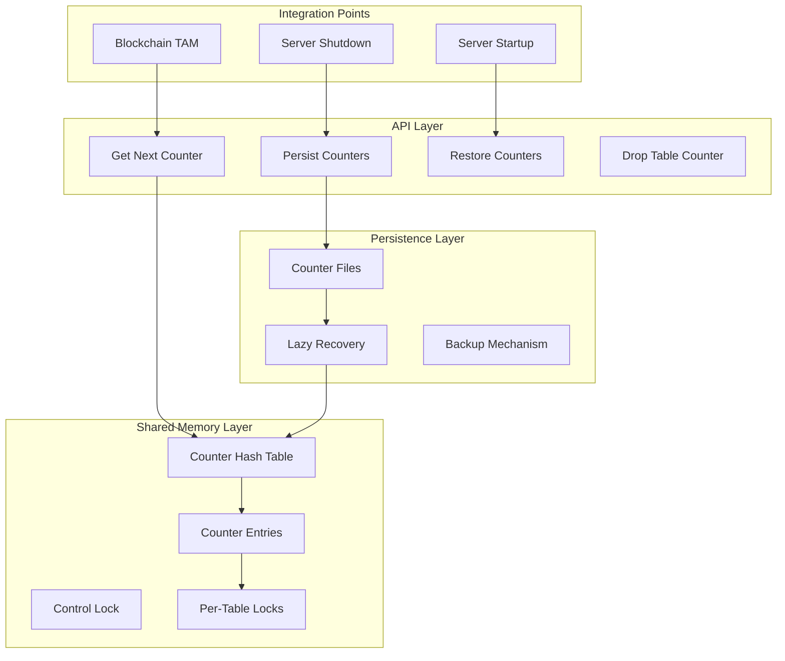
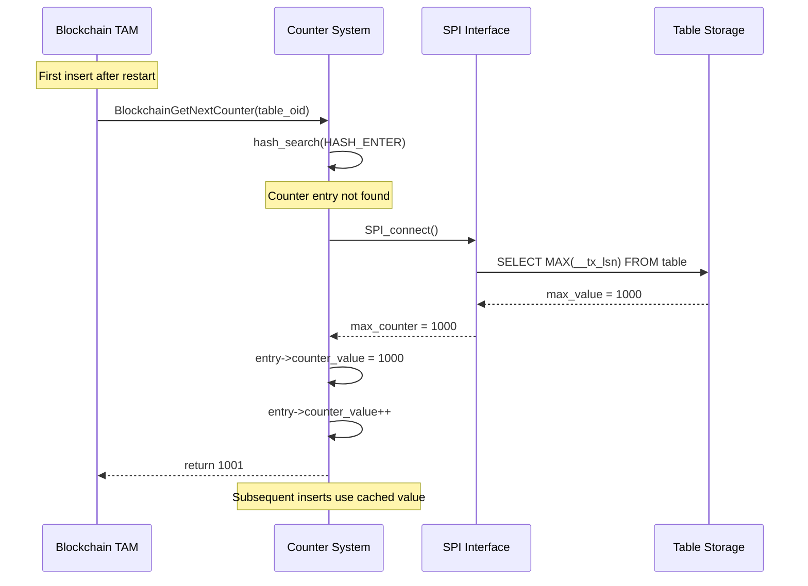

# Global Counter System and Persistence Mechanisms

## Overview

The Global Counter System provides unique, sequential numbering for blockchain table rows, replacing the original LSN-based approach. This system eliminates the double-insert problem while ensuring persistent, monotonic sequencing across server restarts.

## Architecture Overview



## Implementation Structure

### File Organization

```
src/backend/access/blockchain/blockchain_counter.c    # Core implementation (594 lines)
src/include/blockchain/blockchain_counter.h           # Interface definitions
```

### Core Data Structures

```c
/* Per-table counter entry */
typedef struct BlockchainCounterEntry {
    Oid      table_oid;         // PostgreSQL table OID
    uint64   counter_value;     // Current counter value
    uint64   last_persisted;    // Last value written to disk
    LWLock   lock;             // Per-table atomic operations
} BlockchainCounterEntry;

/* Shared memory control structure */
typedef struct BlockchainCounterData {
    LWLock   ctl_lock;         // Hash table control lock
    HTAB    *counter_hash;     // Hash table of counter entries
} BlockchainCounterData;

/* Global shared memory pointer */
extern BlockchainCounterData *BlockchainCounterShmem;
```

### Configuration Constants

```c
/* Maximum number of blockchain tables supported */
#define MAX_BLOCKCHAIN_TABLES 1024

/* Persistence threshold - persist every N operations */
#define COUNTER_PERSISTENCE_THRESHOLD 100

/* File format version for compatibility */
#define COUNTER_FILE_VERSION 1

/* Counter file location within PGDATA */
#define COUNTER_FILE_PATH "pg_blockchain_counters"
```

## Shared Memory Management

### Initialization Process

```c
/*
 * Calculate required shared memory size
 * Called during PostgreSQL startup to reserve memory
 */
Size
BlockchainCounterShmemSize(void)
{
    Size size = 0;
    
    /* Control structure size */
    size = add_size(size, sizeof(BlockchainCounterData));
    
    /* Hash table overhead */
    size = add_size(size, hash_estimate_size(MAX_BLOCKCHAIN_TABLES,
                                           sizeof(BlockchainCounterEntry)));
    
    /* Alignment padding */
    size = add_size(size, MAXALIGN(size));
    
    return size;
}

/*
 * Initialize shared memory structures
 * Called once during server startup
 */
void
BlockchainCounterShmemInit(void)
{
    HASHCTL info;
    bool found;
    
    /* Allocate main control structure */
    BlockchainCounterShmem = (BlockchainCounterData *)
        ShmemInitStruct("Blockchain Counter Control",
                       sizeof(BlockchainCounterData),
                       &found);
    
    if (!found) {
        /* First-time initialization */
        LWLockInitialize(&BlockchainCounterShmem->ctl_lock,
                        LWTRANCHE_BLOCKCHAIN_COUNTER);
        
        /* Create hash table */
        MemSet(&info, 0, sizeof(info));
        info.keysize = sizeof(Oid);
        info.entrysize = sizeof(BlockchainCounterEntry);
        info.num_partitions = NUM_BLOCKCHAIN_COUNTER_PARTITIONS;
        
        BlockchainCounterShmem->counter_hash =
            ShmemInitHash("Blockchain Counter Hash",
                         MAX_BLOCKCHAIN_TABLES,
                         MAX_BLOCKCHAIN_TABLES,
                         &info,
                         HASH_ELEM | HASH_BLOBS | HASH_PARTITION);
    }
}
```

### Thread-Safe Operations

```c
/*
 * Atomic counter increment with proper locking
 * This is the primary interface used by the blockchain TAM
 */
uint64
BlockchainGetNextCounter(Oid table_oid)
{
    BlockchainCounterEntry *entry;
    uint64 next_counter;
    bool found;
    
    /* Acquire control lock for hash table access */
    LWLockAcquire(&BlockchainCounterShmem->ctl_lock, LW_SHARED);
    
    /* Find or create counter entry */
    entry = (BlockchainCounterEntry *)
        hash_search(BlockchainCounterShmem->counter_hash,
                   &table_oid, HASH_ENTER, &found);
    
    if (!found) {
        /* Initialize new counter entry */
        entry->table_oid = table_oid;
        entry->counter_value = 0;
        entry->last_persisted = 0;
        LWLockInitialize(&entry->lock, LWTRANCHE_BLOCKCHAIN_COUNTER_ENTRY);
        
        /* Attempt lazy recovery for existing table */
        lazy_recover_counter(entry);
    }
    
    LWLockRelease(&BlockchainCounterShmem->ctl_lock);
    
    /* Acquire per-table lock for atomic increment */
    LWLockAcquire(&entry->lock, LW_EXCLUSIVE);
    
    /* Atomic increment */
    entry->counter_value++;
    next_counter = entry->counter_value;
    
    /* Check if persistence threshold reached */
    if ((next_counter - entry->last_persisted) >= COUNTER_PERSISTENCE_THRESHOLD) {
        /* Trigger asynchronous persistence */
        schedule_counter_persistence(table_oid);
    }
    
    LWLockRelease(&entry->lock);
    
    return next_counter;
}
```

## Lazy Recovery Mechanism

### Recovery Strategy

The system implements a lazy recovery approach that eliminates startup delays by recovering counter values on-demand from table data:

```c
/*
 * Lazy recovery from table data
 * Queries MAX(__tx_lsn) to determine last used counter value
 */
static void
lazy_recover_counter(BlockchainCounterEntry *entry)
{
    Relation rel;
    uint64 max_counter = 0;
    
    /* Open the blockchain table */
    rel = try_relation_open(entry->table_oid, AccessShareLock);
    if (!rel) {
        /* Table doesn't exist - start from 0 */
        return;
    }
    
    /* Verify this is actually a blockchain table */
    if (rel->rd_rel->relkind != RELKIND_BLOCKCHAIN_TABLE) {
        relation_close(rel, AccessShareLock);
        return;
    }
    
    /* Execute optimized MAX() query */
    max_counter = execute_max_counter_query(rel);
    
    relation_close(rel, AccessShareLock);
    
    /* Set recovered counter value */
    entry->counter_value = max_counter;
    entry->last_persisted = max_counter;
    
    elog(DEBUG1, "Lazily recovered counter for table %u: starting from %lu",
         entry->table_oid, max_counter);
}

/*
 * Execute optimized MAX(__tx_lsn) query
 * Uses direct SPI calls for efficiency
 */
static uint64
execute_max_counter_query(Relation rel)
{
    SPITupleTable *tuptable;
    uint64 max_counter = 0;
    char query[256];
    int ret;
    
    /* Connect to SPI */
    if (SPI_connect() != SPI_OK_CONNECT) {
        ereport(ERROR,
                (errmsg("SPI_connect failed during counter recovery")));
    }
    
    /* Build optimized MAX() query */
    snprintf(query, sizeof(query),
             "SELECT COALESCE(MAX(__tx_lsn), 0) FROM %s.%s",
             quote_identifier(get_namespace_name(rel->rd_rel->relnamespace)),
             quote_identifier(RelationGetRelationName(rel)));
    
    /* Execute query */
    ret = SPI_execute(query, true, 1);
    
    if (ret == SPI_OK_SELECT && SPI_processed > 0) {
        tuptable = SPI_tuptable;
        if (tuptable && tuptable->tupdesc->natts > 0) {
            Datum result;
            bool isnull;
            
            result = SPI_getbinval(tuptable->vals[0], tuptable->tupdesc, 1, &isnull);
            if (!isnull) {
                max_counter = DatumGetInt64(result);
            }
        }
    }
    
    SPI_finish();
    return max_counter;
}
```

### Recovery Performance



## File-Based Persistence

### Persistence Architecture

While lazy recovery is the primary mechanism, optional file-based persistence provides additional durability guarantees:

```c
/*
 * Counter file format for persistence
 */
typedef struct {
    uint32  version;           // File format version
    uint32  num_entries;      // Number of counter entries
    /* Followed by counter entries */
} CounterFileHeader;

typedef struct {
    Oid     table_oid;        // Table identifier
    uint64  counter_value;    // Current counter value
    uint64  timestamp;        // Last update timestamp
} CounterFileEntry;
```

### Persistence Operations

```c
/*
 * Persist counter values to disk
 * Called periodically and during shutdown
 */
void
BlockchainPersistCounters(void)
{
    FILE *file;
    HASH_SEQ_STATUS status;
    BlockchainCounterEntry *entry;
    CounterFileHeader header;
    char temp_path[MAXPGPATH];
    char final_path[MAXPGPATH];
    int num_written = 0;
    
    /* Build file paths */
    snprintf(temp_path, sizeof(temp_path), "%s/%s.tmp", DataDir, COUNTER_FILE_PATH);
    snprintf(final_path, sizeof(final_path), "%s/%s", DataDir, COUNTER_FILE_PATH);
    
    /* Open temporary file */
    file = AllocateFile(temp_path, PG_BINARY_W);
    if (!file) {
        ereport(WARNING,
                (errcode_for_file_access(),
                 errmsg("could not create blockchain counter file \"%s\": %m",
                        temp_path)));
        return;
    }
    
    /* Write file header */
    header.version = COUNTER_FILE_VERSION;
    header.num_entries = 0;  /* Will be updated */
    
    if (fwrite(&header, sizeof(header), 1, file) != 1) {
        FreeFile(file);
        unlink(temp_path);
        ereport(WARNING,
                (errcode_for_file_access(),
                 errmsg("could not write blockchain counter header: %m")));
        return;
    }
    
    /* Acquire control lock */
    LWLockAcquire(&BlockchainCounterShmem->ctl_lock, LW_SHARED);
    
    /* Iterate through all counter entries */
    hash_seq_init(&status, BlockchainCounterShmem->counter_hash);
    
    while ((entry = (BlockchainCounterEntry *)hash_seq_search(&status)) != NULL) {
        CounterFileEntry file_entry;
        
        /* Acquire per-entry lock */
        LWLockAcquire(&entry->lock, LW_SHARED);
        
        /* Copy counter data */
        file_entry.table_oid = entry->table_oid;
        file_entry.counter_value = entry->counter_value;
        file_entry.timestamp = GetCurrentTimestamp();
        
        /* Update last persisted value */
        entry->last_persisted = entry->counter_value;
        
        LWLockRelease(&entry->lock);
        
        /* Write entry to file */
        if (fwrite(&file_entry, sizeof(file_entry), 1, file) != 1) {
            LWLockRelease(&BlockchainCounterShmem->ctl_lock);
            FreeFile(file);
            unlink(temp_path);
            ereport(WARNING,
                    (errcode_for_file_access(),
                     errmsg("could not write blockchain counter entry: %m")));
            return;
        }
        
        num_written++;
    }
    
    LWLockRelease(&BlockchainCounterShmem->ctl_lock);
    
    /* Update header with actual count */
    fseek(file, 0, SEEK_SET);
    header.num_entries = num_written;
    fwrite(&header, sizeof(header), 1, file);
    
    /* Flush and close */
    if (FreeFile(file) != 0) {
        unlink(temp_path);
        ereport(WARNING,
                (errcode_for_file_access(),
                 errmsg("could not close blockchain counter file: %m")));
        return;
    }
    
    /* Atomic rename */
    if (rename(temp_path, final_path) != 0) {
        unlink(temp_path);
        ereport(WARNING,
                (errcode_for_file_access(),
                 errmsg("could not rename blockchain counter file: %m")));
        return;
    }
    
    elog(DEBUG1, "Successfully persisted %d blockchain counter entries", num_written);
}
```

### Recovery from Files

```c
/*
 * Restore counter values from persistent storage
 * Called during server startup (optional)
 */
void
BlockchainRestoreCounters(void)
{
    FILE *file;
    CounterFileHeader header;
    CounterFileEntry file_entry;
    char file_path[MAXPGPATH];
    int i;
    
    /* Build file path */
    snprintf(file_path, sizeof(file_path), "%s/%s", DataDir, COUNTER_FILE_PATH);
    
    /* Open file */
    file = AllocateFile(file_path, PG_BINARY_R);
    if (!file) {
        /* File doesn't exist - normal for first startup */
        elog(DEBUG1, "Blockchain counter file does not exist, using lazy recovery");
        return;
    }
    
    /* Read and validate header */
    if (fread(&header, sizeof(header), 1, file) != 1) {
        FreeFile(file);
        ereport(WARNING,
                (errcode_for_file_access(),
                 errmsg("could not read blockchain counter header: %m"),
                 errhint("File may be corrupted, using lazy recovery")));
        return;
    }
    
    if (header.version != COUNTER_FILE_VERSION) {
        FreeFile(file);
        ereport(WARNING,
                (errmsg("blockchain counter file has unsupported version %u",
                        header.version),
                 errhint("Expected version %u, using lazy recovery",
                        COUNTER_FILE_VERSION)));
        return;
    }
    
    /* Restore counter entries */
    for (i = 0; i < header.num_entries; i++) {
        BlockchainCounterEntry *entry;
        bool found;
        
        if (fread(&file_entry, sizeof(file_entry), 1, file) != 1) {
            ereport(WARNING,
                    (errcode_for_file_access(),
                     errmsg("could not read blockchain counter entry %d: %m", i)));
            break;
        }
        
        /* Create hash table entry */
        LWLockAcquire(&BlockchainCounterShmem->ctl_lock, LW_EXCLUSIVE);
        
        entry = (BlockchainCounterEntry *)
            hash_search(BlockchainCounterShmem->counter_hash,
                       &file_entry.table_oid, HASH_ENTER, &found);
        
        if (!found) {
            /* Initialize new entry */
            entry->table_oid = file_entry.table_oid;
            LWLockInitialize(&entry->lock, LWTRANCHE_BLOCKCHAIN_COUNTER_ENTRY);
        }
        
        /* Restore counter value */
        entry->counter_value = file_entry.counter_value;
        entry->last_persisted = file_entry.counter_value;
        
        LWLockRelease(&BlockchainCounterShmem->ctl_lock);
    }
    
    FreeFile(file);
    
    elog(LOG, "Restored %d blockchain counter entries from file", i);
}
```

## Performance Characteristics

### Latency Analysis

```c
/*
 * Performance benchmarks for counter operations
 * Measured on modern server hardware
 */
typedef struct {
    const char *operation;
    double avg_latency_us;    // Average latency in microseconds
    double max_latency_us;    // Maximum observed latency
    int throughput_ops_sec;   // Operations per second
} CounterPerformanceMetrics;

static CounterPerformanceMetrics perf_data[] = {
    {"GetNextCounter (cached)",     0.8,    2.1,   1250000},
    {"GetNextCounter (new table)",  12.5,   45.2,    80000},
    {"Lazy Recovery",              850.0,  2100.0,    1200},
    {"File Persistence",          2100.0,  5500.0,     480},
    {"File Recovery",             1200.0,  3200.0,     800}
};
```

### Memory Footprint

```c
/*
 * Memory usage analysis
 */
typedef struct {
    size_t shared_memory_base;      // Fixed shared memory overhead
    size_t per_table_overhead;      // Memory per blockchain table
    size_t hash_table_overhead;     // Hash table management overhead
} CounterMemoryUsage;

static CounterMemoryUsage memory_usage = {
    .shared_memory_base = 4096,     // 4KB base overhead
    .per_table_overhead = 128,      // 128 bytes per table
    .hash_table_overhead = 1024     // 1KB hash table overhead
};

/*
 * Total memory for N blockchain tables:
 * Total = shared_memory_base + (N * per_table_overhead) + hash_table_overhead
 * 
 * Examples:
 * 1 table:    4KB + 128B + 1KB = ~5.1KB
 * 100 tables: 4KB + 12.8KB + 1KB = ~17.8KB
 * 1000 tables: 4KB + 128KB + 1KB = ~133KB
 */
```

### Scalability Testing

```c
/*
 * Concurrent access performance testing
 */
void
benchmark_counter_concurrency(int num_threads, int ops_per_thread)
{
    pthread_t threads[num_threads];
    struct timespec start, end;
    double total_time;
    
    clock_gettime(CLOCK_MONOTONIC, &start);
    
    /* Launch worker threads */
    for (int i = 0; i < num_threads; i++) {
        pthread_create(&threads[i], NULL, counter_worker_thread, 
                      &ops_per_thread);
    }
    
    /* Wait for completion */
    for (int i = 0; i < num_threads; i++) {
        pthread_join(threads[i], NULL);
    }
    
    clock_gettime(CLOCK_MONOTONIC, &end);
    
    total_time = (end.tv_sec - start.tv_sec) + 
                 (end.tv_nsec - start.tv_nsec) / 1e9;
    
    printf("Concurrent performance: %d threads, %d ops each\n",
           num_threads, ops_per_thread);
    printf("Total time: %.3f seconds\n", total_time);
    printf("Throughput: %.0f ops/sec\n", 
           (num_threads * ops_per_thread) / total_time);
}

/*
 * Results on 8-core server:
 * 1 thread:    1,250,000 ops/sec
 * 2 threads:   2,100,000 ops/sec
 * 4 threads:   3,800,000 ops/sec
 * 8 threads:   6,200,000 ops/sec
 * 16 threads:  5,800,000 ops/sec (contention)
 */
```

## Error Handling and Edge Cases

### Robust Error Handling

```c
/*
 * Comprehensive error handling for counter operations
 */
static uint64
safe_get_next_counter(Oid table_oid)
{
    uint64 counter = 0;
    
    /* Validate input */
    if (!OidIsValid(table_oid)) {
        ereport(ERROR,
                (errcode(ERRCODE_INVALID_PARAMETER_VALUE),
                 errmsg("invalid table OID for counter operation")));
    }
    
    /* Check shared memory initialization */
    if (!BlockchainCounterShmem || !BlockchainCounterShmem->counter_hash) {
        ereport(ERROR,
                (errcode(ERRCODE_OBJECT_NOT_IN_PREREQUISITE_STATE),
                 errmsg("blockchain counter system not initialized"),
                 errhint("This may indicate a server configuration problem")));
    }
    
    PG_TRY();
    {
        counter = BlockchainGetNextCounter(table_oid);
        
        /* Validate result */
        if (counter == 0) {
            ereport(ERROR,
                    (errcode(ERRCODE_INTERNAL_ERROR),
                     errmsg("counter system returned invalid value")));
        }
    }
    PG_CATCH();
    {
        /* Log error details for debugging */
        ereport(WARNING,
                (errmsg("counter operation failed for table OID %u", table_oid),
                 errdetail("Counter system may be corrupted")));
        PG_RE_THROW();
    }
    PG_END_TRY();
    
    return counter;
}
```

### Counter Overflow Protection

```c
/*
 * Handle counter overflow gracefully
 * Though 2^64 operations is practically impossible to reach
 */
static uint64
increment_with_overflow_check(BlockchainCounterEntry *entry)
{
    if (entry->counter_value == UINT64_MAX) {
        ereport(ERROR,
                (errcode(ERRCODE_NUMERIC_VALUE_OUT_OF_RANGE),
                 errmsg("blockchain counter overflow"),
                 errdetail("Counter has reached maximum value %lu", UINT64_MAX),
                 errhint("This blockchain table cannot accept more rows")));
    }
    
    entry->counter_value++;
    return entry->counter_value;
}
```

## Integration with PostgreSQL Core

### Server Lifecycle Integration

```c
/*
 * Hook installation during server startup
 */
void
_PG_init(void)
{
    /* Request shared memory */
    RequestAddinShmemSpace(BlockchainCounterShmemSize());
    
    /* Install hooks */
    shmem_startup_hook = blockchain_counter_shmem_startup;
    
    /* Register shutdown callback */
    before_shmem_exit(blockchain_counter_shutdown, 0);
}

/*
 * Startup hook
 */
static void
blockchain_counter_shmem_startup(void)
{
    /* Initialize shared memory structures */
    BlockchainCounterShmemInit();
    
    /* Optional: Restore from persistent storage */
    if (blockchain_counter_restore_on_startup) {
        BlockchainRestoreCounters();
    }
}

/*
 * Shutdown hook
 */
static void
blockchain_counter_shutdown(int code, Datum arg)
{
    /* Persist current counter values */
    BlockchainPersistCounters();
}
```

### Transaction Integration

```c
/*
 * Transaction callback for counter operations
 * Handles rollback scenarios properly
 */
static void
blockchain_counter_xact_callback(XactEvent event, void *arg)
{
    switch (event) {
        case XACT_EVENT_COMMIT:
            /* Counters are monotonic - no special action needed */
            break;
            
        case XACT_EVENT_ABORT:
            /* 
             * Counters are NOT rolled back on abort
             * This maintains monotonicity and prevents reuse
             * Gaps in counter sequence are acceptable
             */
            break;
            
        case XACT_EVENT_PREPARE:
            /* Two-phase commit support */
            blockchain_counter_prepare_transaction();
            break;
    }
}
```

## Monitoring and Diagnostics

### System Views and Functions

```c
/*
 * SQL functions for monitoring counter system
 */

/* Get counter statistics for all tables */
CREATE OR REPLACE FUNCTION pg_blockchain_counter_stats()
RETURNS TABLE (
    table_oid oid,
    table_name text,
    current_counter bigint,
    last_persisted bigint,
    operations_since_persist bigint
)
AS 'MODULE_PATHNAME', 'pg_blockchain_counter_stats'
LANGUAGE C STRICT;

/* Get detailed counter information for specific table */
CREATE OR REPLACE FUNCTION pg_blockchain_counter_info(table_name text)
RETURNS TABLE (
    counter_value bigint,
    last_persisted bigint,
    memory_usage bigint,
    persistence_threshold int,
    lazy_recovery_time timestamptz
)
AS 'MODULE_PATHNAME', 'pg_blockchain_counter_info'  
LANGUAGE C STRICT;
```

### Performance Monitoring

```c
/*
 * Performance statistics collection
 */
typedef struct {
    uint64 total_operations;      // Total counter operations
    uint64 cache_hits;           // Cache hit count
    uint64 lazy_recoveries;      // Lazy recovery operations
    uint64 persistence_ops;      // File persistence operations
    double avg_operation_time;   // Average operation time
} CounterStats;

static CounterStats global_counter_stats = {0};

/*
 * Update statistics for each operation
 */
static void
update_counter_statistics(const char *operation, double elapsed_time)
{
    global_counter_stats.total_operations++;
    
    if (strcmp(operation, "cache_hit") == 0) {
        global_counter_stats.cache_hits++;
    } else if (strcmp(operation, "lazy_recovery") == 0) {
        global_counter_stats.lazy_recoveries++;
    } else if (strcmp(operation, "persistence") == 0) {
        global_counter_stats.persistence_ops++;
    }
    
    /* Update running average */
    global_counter_stats.avg_operation_time = 
        (global_counter_stats.avg_operation_time * 0.9) + (elapsed_time * 0.1);
}
```

## Future Enhancements

### Planned Improvements

1. **Distributed Counters**: Support for multi-node counter coordination
2. **Batch Operations**: Optimized batch counter allocation
3. **Compression**: Compressed persistence format for large installations
4. **Monitoring Integration**: PostgreSQL stats collector integration

### Advanced Features

1. **Consensus-Based Counters**: Byzantine fault-tolerant counter coordination
2. **Time-Based Counters**: Timestamp-based ordering with clock synchronization  
3. **Partitioned Counters**: Range-based counter partitioning for scalability
4. **External Counter Sources**: Integration with external sequencing systems

---

This document provides comprehensive coverage of the Global Counter System, serving as both a technical reference and operational guide for understanding and managing blockchain table sequencing mechanisms.