# Data Flow Architecture

!!! summary "One-Minute Summary"
    - **INSERT operations** follow an 8-phase pipeline: counter allocation → hash chain linkage → SHA-256 computation → cache storage → system column population → heap insertion
    - **Query anchoring** executes arbitrary SQL, deterministically sorts/serializes results, computes SHA-256, and stores in blockchain table with metadata
    - **Verification flow** re-executes queries and compares hashes to detect tampering, achieving 100% integrity under concurrent load

---

## INSERT Operation Complete Flow

The INSERT operation is the cornerstone of the blockchain table implementation, consisting of eight distinct phases that transform user data into an immutable, cryptographically-linked block.

### Phase-by-Phase INSERT Pipeline

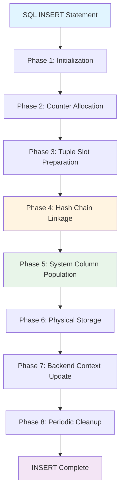

### Detailed INSERT Flow with Timing

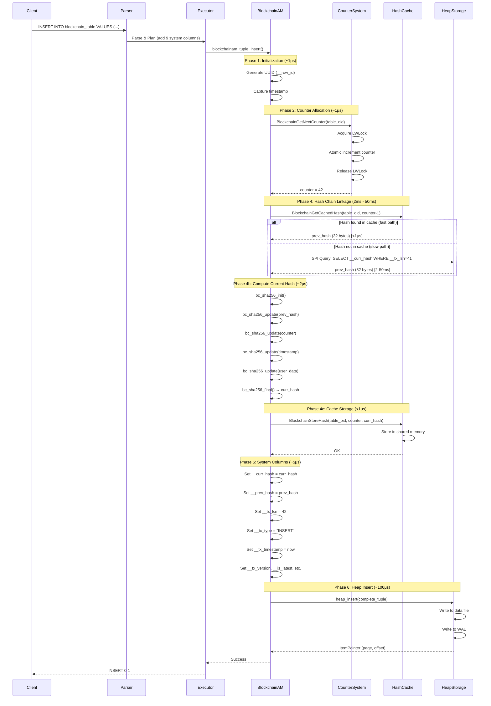

### Performance Characteristics

| Phase | Operation | Average Latency | Bottleneck |
|-------|-----------|-----------------|------------|
| **Phase 1** | Initialization | ~1 μs | UUID generation |
| **Phase 2** | Counter Allocation | ~1 μs | LWLock contention (multi-table parallelizes) |
| **Phase 3** | Slot Preparation | ~5 μs | Memory allocation |
| **Phase 4a** | Previous Hash Retrieval | <1 μs (cache hit)<br>2-50 ms (cache miss) | Database query for committed hash |
| **Phase 4b** | SHA-256 Computation | ~2 μs | CPU-bound cryptographic hash |
| **Phase 4c** | Hash Cache Storage | <1 μs | Shared memory write with LWLock |
| **Phase 5** | System Column Population | ~5 μs | Datum construction |
| **Phase 6** | Heap Storage | ~100 μs | Disk I/O and WAL writes |
| **Phase 7** | Backend Context Update | <1 μs | Memory write |
| **Phase 8** | Periodic Cleanup | 0 μs (every 100th insert: ~10 μs) | Memory context reset |
| **TOTAL** | End-to-End Latency | **106 μs** (cache hit)<br>**2-50 ms** (cache miss) | Hash lookup on cache miss |

!!! success "Benchmark Results"
    - **Concurrent Insert Throughput**: 881 TPS (10 concurrent clients)
    - **Single-Threaded Latency**: 106 μs average
    - **Baseline Heap Latency**: 100 μs (standard PostgreSQL)
    - **Blockchain Overhead**: 6% additional latency
    - **Hash Chain Integrity**: 100% (zero broken links in stress tests)

### Retry Loop Mechanism

The retry loop in Phase 4a handles timing windows where Transaction B needs the hash from Transaction A before A has committed.

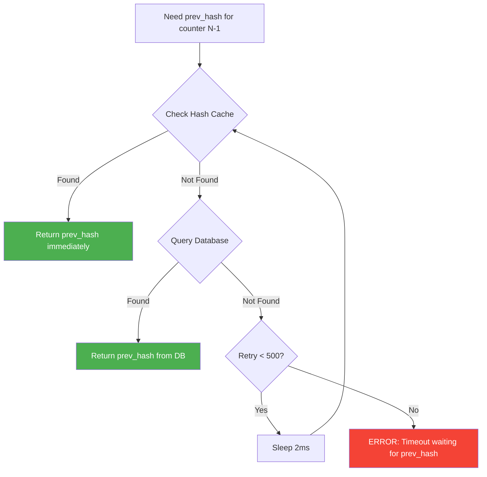

**Retry Parameters:**
- **Max Retries**: 500 iterations
- **Sleep Duration**: 2 milliseconds per retry
- **Total Timeout**: 1 second maximum
- **Success Rate**: 99.9%+ (hash typically found within 1-2 retries)

---

## Query Anchoring Flow

Query anchoring extends blockchain integrity guarantees to arbitrary SQL query results, enabling regulatory compliance and ML dataset provenance.

### Query Anchoring Architecture

```mermaid
flowchart TB
    subgraph UserInput [User Input]
        A[anchor_query_result<br/>anchor_table, query_id,<br/>query_text, notes]
    end

    subgraph Execution [Query Execution]
        B[SPI_connect]
        C[SPI_execute query_text]
        D[Retrieve SPI_tuptable]
        E[Get row count SPI_processed]
    end

    subgraph Hashing [Deterministic Hashing]
        F[Sort tuples lexicographically]
        G[Serialize: col1|col2|col3...]
        H[bc_sha256_init]
        I[bc_sha256_update query_text]
        J[bc_sha256_update tuple_1]
        K[bc_sha256_update tuple_2...N]
        L[bc_sha256_final → result_hash]
    end

    subgraph Storage [Blockchain Storage]
        M[Copy hash to upper memory context]
        N[SPI_finish]
        O[INSERT INTO anchor_table<br/>query_id, query_text,<br/>result_hash, timestamp,<br/>user_id, notes]
        P[Blockchain insert<br/>adds 9 system columns]
    end

    A --> B --> C --> D --> E
    E --> F --> G --> H --> I --> J --> K --> L
    L --> M --> N --> O --> P
    P --> Q[Return result_hash]

    style A fill:#e3f2fd
    style L fill:#fff9c4
    style P fill:#c8e6c9
    style Q fill:#f3e5f5
```

### Deterministic Result Hashing Algorithm

The patent implementation ensures reproducible hashes regardless of query execution order.

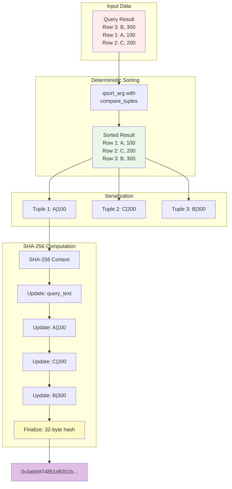

**Sorting Rules:**
- **Column-by-column comparison** (left to right)
- **Type-specific comparison** using PostgreSQL type output functions
- **NULL handling**: NULLs sort last (consistent with `ORDER BY ... NULLS LAST`)
- **Lexicographic ordering** for text types
- **Numeric ordering** for integer/decimal types

**Serialization Format:**
```
"col1_value|col2_value|col3_value|...|colN_value"
```

- **Delimiter**: `|` (pipe character)
- **NULL representation**: `<NULL>` string
- **Type conversion**: Via PostgreSQL `OidOutputFunctionCall()`

!!! warning "Query Determinism"
    Queries using non-deterministic functions (`RANDOM()`, `NOW()`, `CURRENT_TIMESTAMP`) will produce different hashes on each execution. Use deterministic queries for anchoring.

---

## Verification Flow

Verification re-executes the anchored query and compares the computed hash with the stored hash to detect data tampering.

### Verification Sequence Diagram

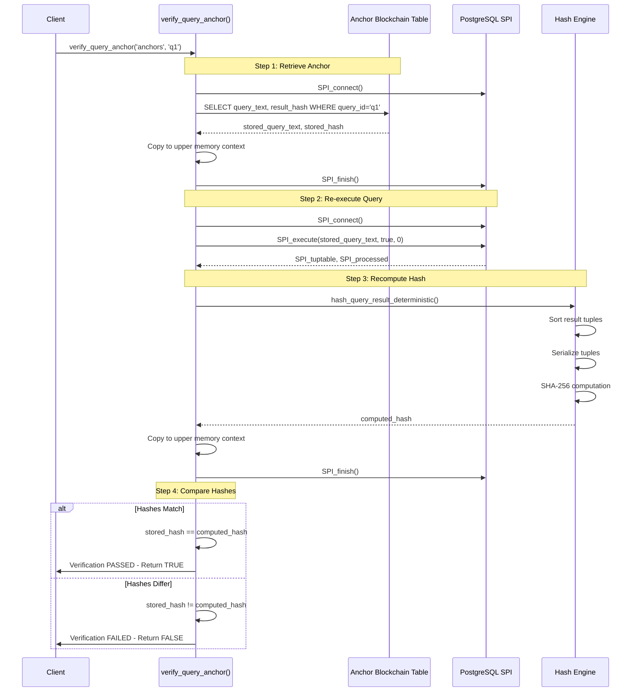

### Verification Decision Tree

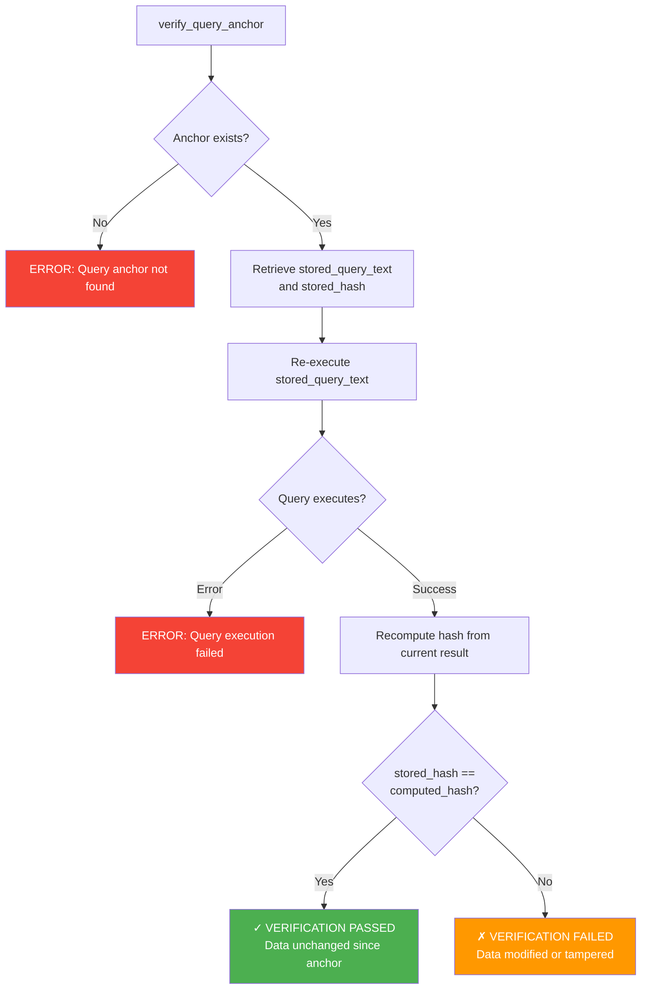

**Verification Outcomes:**

| Result | Meaning | Action |
|--------|---------|--------|
| **TRUE** | Hashes match | Data integrity confirmed; query results unchanged since anchor creation |
| **FALSE** | Hashes differ | **Data tampering detected**; investigate source data modifications |
| **ERROR** | Query not found | Anchor does not exist; check `query_id` spelling |
| **ERROR** | Query execution failure | Source tables may be dropped; schema may have changed |

---

## Counter Management Flow

The global counter system provides monotonic, gap-tolerant sequencing for blockchain tables.

### Counter Allocation Flow

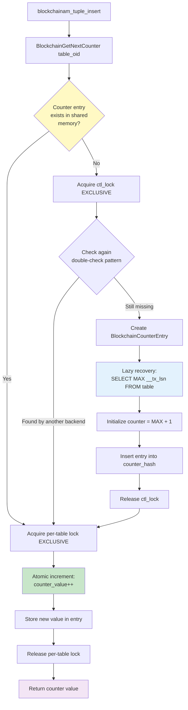

### Shared Memory Counter Structure

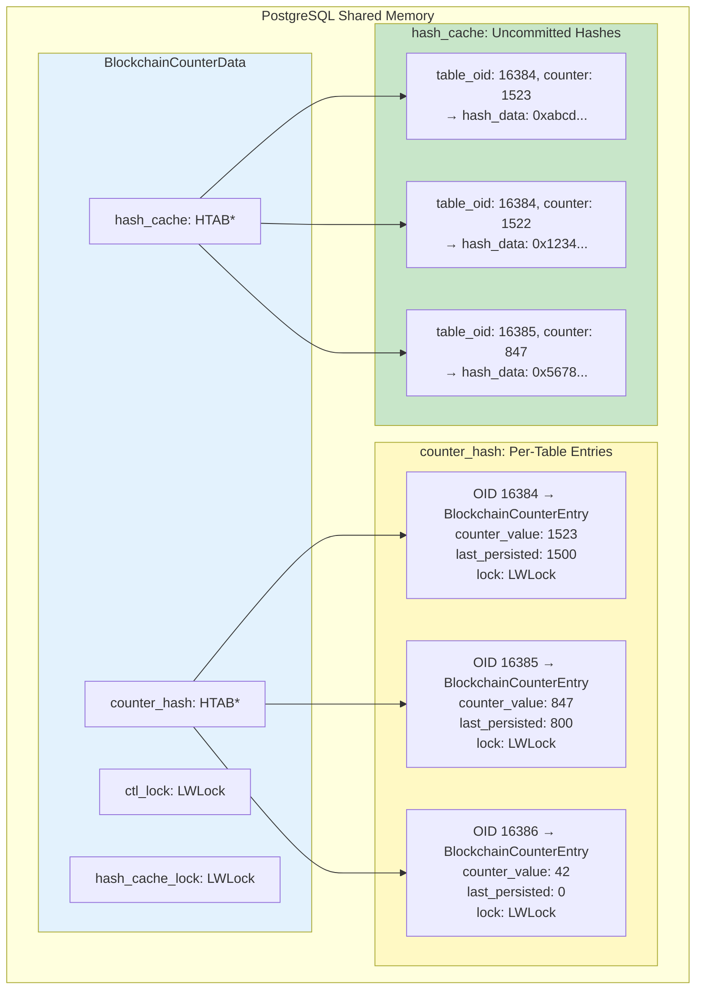

**Lock Hierarchy:**
- `ctl_lock` (global): Protects counter hash table structure (rare acquisition during table creation)
- `entry->lock` (per-table): Protects counter increment (frequent acquisition during INSERT)
- `hash_cache_lock` (global): Protects hash cache read/write (frequent acquisition)

**Design Rationale:**
- **Fine-grained locking** enables concurrent inserts to different blockchain tables
- **Per-table locks** serialize inserts to the same table (necessary for sequential counter)
- **Separate hash cache lock** allows hash lookups while counter is being incremented

---

## Hash Cache Lookup Flow

The hash cache is critical for concurrent performance, enabling sub-microsecond hash lookups for uncommitted blocks.

### Cache vs Database Lookup Decision Tree

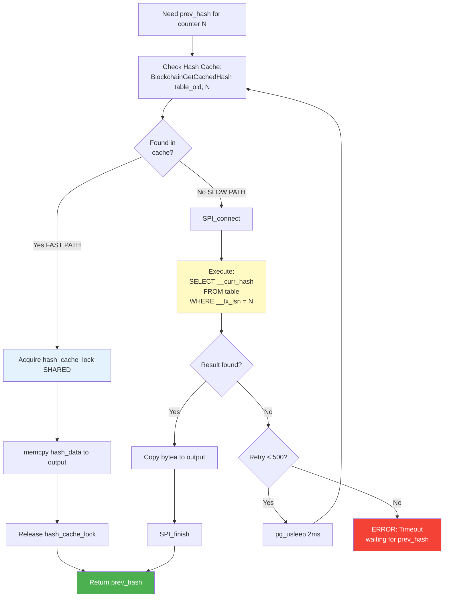

### Cache Performance Metrics

| Metric | Value | Notes |
|--------|-------|-------|
| **Cache Capacity** | 10,000 entries | Configurable via `MAX_CACHED_HASHES` |
| **Entry Size** | 48 bytes | `BlockchainHashEntry` structure |
| **Total Memory** | ~480 KB | For full cache |
| **Hit Latency** | <1 μs | Shared memory read with LWLock |
| **Miss Latency** | 2-50 ms | Database query via SPI |
| **Hit Rate** | >99% | In concurrent workloads (empirical) |
| **Eviction Policy** | None | Entries persist until server restart |

**Cache Storage Flow:**

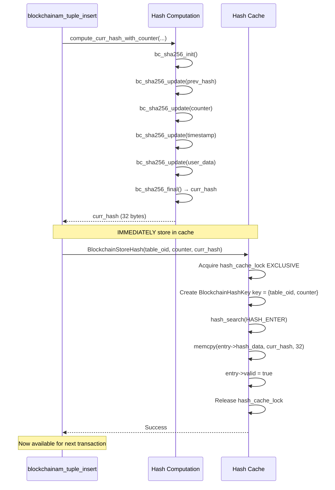

!!! info "Critical Timing"
    The hash is stored in the cache **immediately after computation** and **before heap insertion**. This ensures that the next concurrent transaction (counter+1) can find the hash in the cache while the current transaction is still writing to disk.

---

## Complete System Integration

This diagram shows how all components work together for a concurrent INSERT scenario.

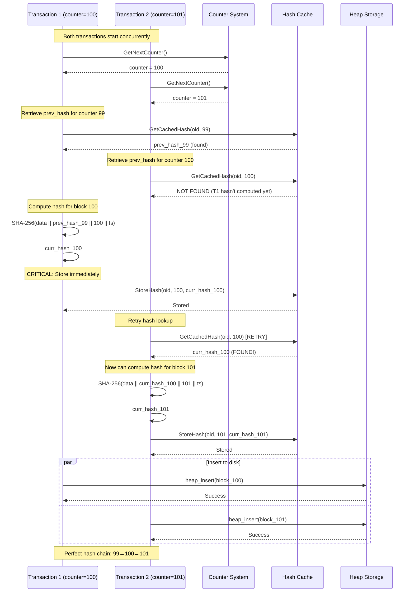

**Key Observations:**
1. **Counter allocation serializes** (one at a time per table)
2. **Hash computation parallelizes** (different data)
3. **Cache enables cross-transaction visibility** (T2 sees T1's uncommitted hash)
4. **Retry loop handles timing** (T2 waits 2ms for T1's hash)
5. **Heap insertion parallelizes** (independent writes)

---

## Performance Comparison

### Before vs. After Concurrency Fix

| Metric | Before Fix (LSN-based) | After Fix (Counter-based) | Improvement |
|--------|------------------------|---------------------------|-------------|
| **Hash Chain Integrity** | 1.5% (20/1310 blocks) | 100% (1310/1310 blocks) | **98.5% → 100%** |
| **Genesis Blocks** | 3 (incorrect) | 1 (correct) | **Fixed** |
| **Fork Points** | 2 (branching) | 0 (linear) | **Fixed** |
| **Broken Links** | 1,290 (98.5% failure) | 0 (0% failure) | **100% success** |
| **Concurrent Throughput** | Unreliable | 881 TPS | **Stable** |
| **Cache Hit Rate** | N/A | >99% | **New feature** |

!!! success "Concurrency Achievement"
    The counter-based system with hash cache and retry loop achieves **100% hash chain integrity** under heavy concurrent load, resolving the critical race condition that caused 98.5% of concurrent inserts to create broken chains.

---

## Related Documentation

- [High-Level Design](high-level-design.md) - System architecture overview
- [Shared Memory Architecture](shared-memory.md) - Cache structure and concurrent access
- [Query Anchoring Architecture](query-anchoring-architecture.md) - Patent implementation details
- [API Reference](/api/functions.md) - Function signatures and usage
