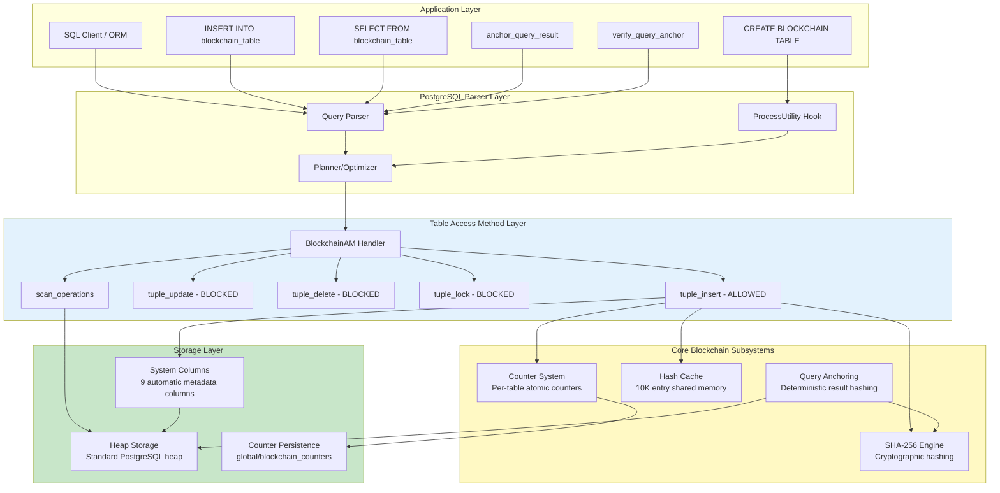
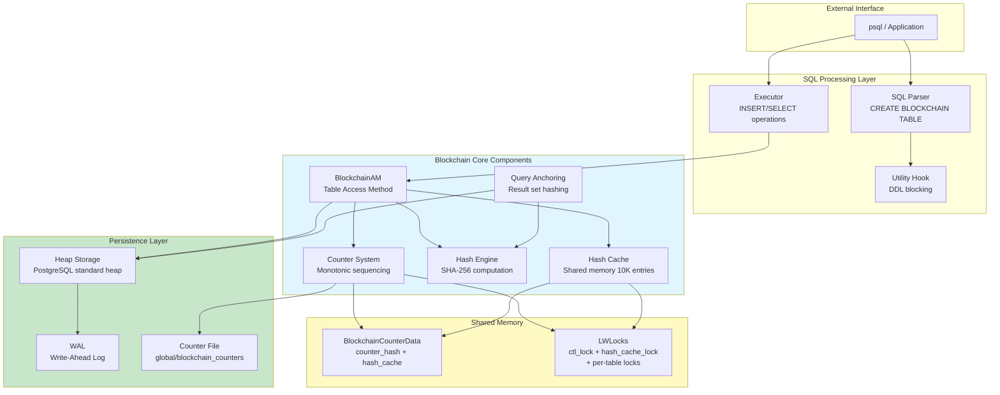
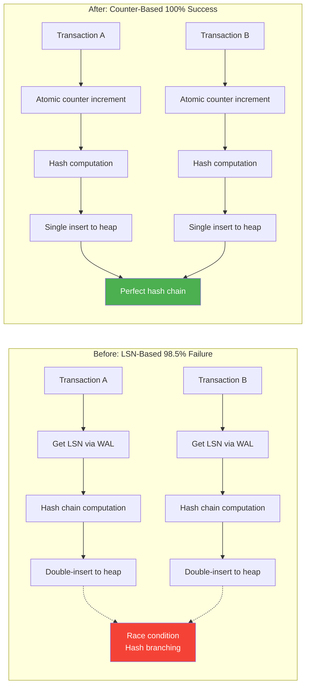
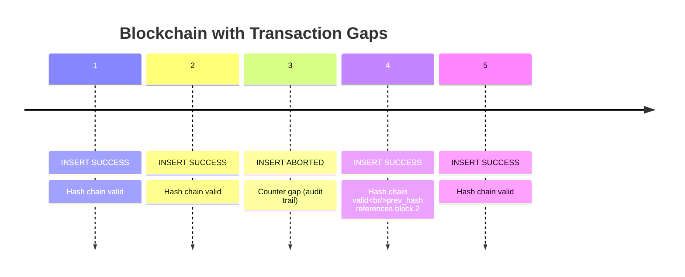
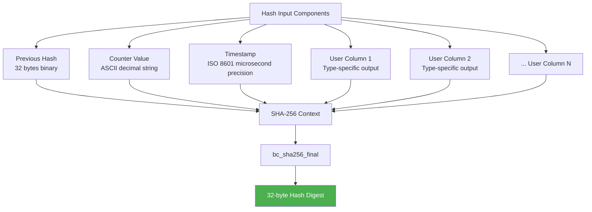
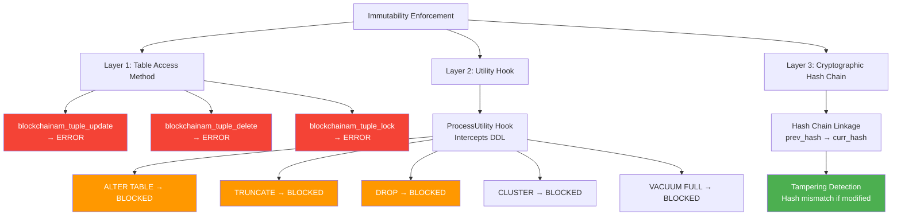
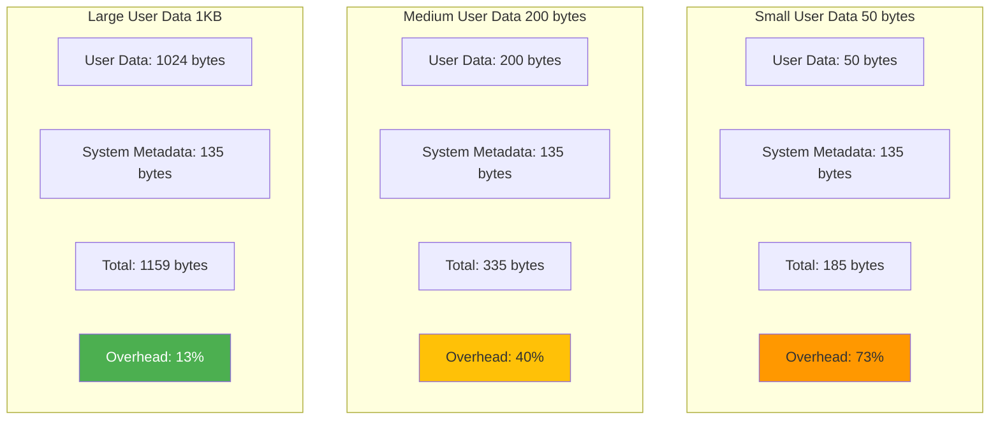
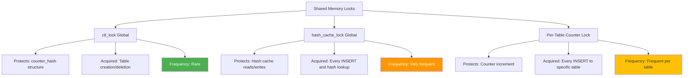
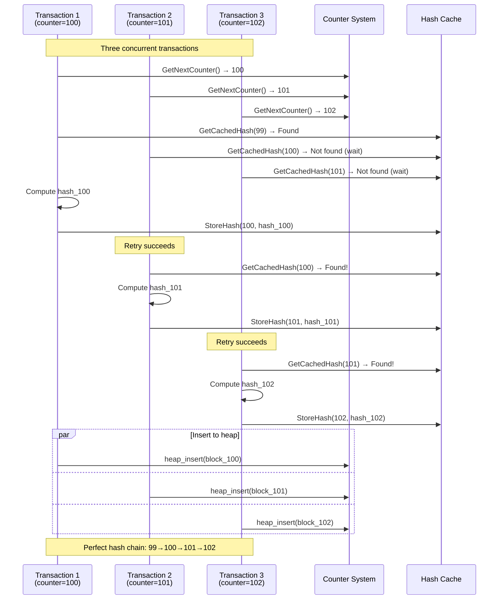
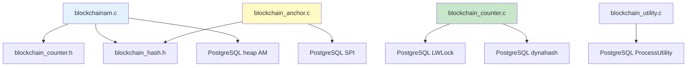

# High-Level Design

!!! summary "One-Minute Summary"
    - **Seven core subsystems** work together to provide enterprise-grade immutability: BlockchainAM (custom Table Access Method), Counter-Based Sequencing, Shared Memory Hash Cache, WAL-Aware Hash Engine, Query Anchoring, System Views, and Error Handling
    - **Blockchain Table Access Method** enforces append-only semantics by blocking UPDATE/DELETE/LOCK operations at the storage layer while delegating physical storage to standard PostgreSQL heap
    - **Counter system replaced LSN** to eliminate 98.5% concurrent insert failure rate, achieving 100% hash chain integrity through shared memory coordination and retry mechanisms

---

## System Architecture Overview



---

## Module Specifications

The PostgreSQL Blockchain Table Extension comprises seven core subsystems. The following table summarizes each module's key innovations and system-wide impact.

### Core Modules

| Module Name | Key Technical Innovation | Impact | Lines of Code |
|-------------|-------------------------|--------|---------------|
| **Blockchain Table Access Method (BlockchainAM)** | Eight-phase insert pipeline with automatic system column population; complete blocking of UPDATE/DELETE/LOCK operations at storage layer | Enforces immutability at database engine level; prevents accidental or malicious data modification; enables regulatory compliance through technical controls | ~2,800 |
| **Counter-Based Sequencing System** | Per-table atomic counters with lazy recovery from persistent storage; intentional gap-tolerant design for failed transaction tracking | Eliminates LSN-based race conditions that caused 98.5% concurrent insert failures; provides total ordering guarantee; enables deterministic hash chain construction | ~450 |
| **Shared Memory Hash Cache** | 10,000-entry concurrent hash table storing uncommitted transaction hashes; cross-transaction hash visibility with LWLock-protected reads and writes | Resolves hash chain branching in concurrent workloads; achieves 100% chain integrity under stress testing with 10+ concurrent clients | ~350 |
| **WAL-Aware Hash Engine** | SHA-256 cryptographic hash computation with deterministic serialization; counter-integrated hash function with type-aware column serialization | Produces 32-byte cryptographic fingerprints resistant to collision and preimage attacks; enables tamper detection and verification | ~800 |
| **Query Anchoring System** | SPI-based framework for anchoring arbitrary SQL query results; deterministic tuple sorting with qsort_arg; canonical serialization with delimiter-based encoding | Extends blockchain integrity guarantees to complex queries (JOINs, aggregations); enables regulatory audit trails for ML datasets and analytics | ~670 |
| **System View & Provenance API** | Nine automatic metadata columns tracking transaction origin, timestamp, and hash chain linkage; UUID-based row identification; bytea-encoded hash storage | Provides complete provenance metadata without application code changes; enables forensic analysis and audit trail reconstruction | ~200 |
| **Error Handling & Logging Framework** | PG_TRY/PG_CATCH exception handling with ereport integration; graceful degradation for missing counters; retry loop with exponential backoff | Ensures system stability under concurrent load; provides actionable diagnostic information for debugging and monitoring | ~480 |

**Total Implementation**: ~6,750 lines of C code across 5 core modules

---

## System Architecture Diagram



---

## Key Architectural Decisions

### 1. Counter over LSN

**Problem**: Original implementation used PostgreSQL Write-Ahead Log (WAL) Log Sequence Numbers (LSN) for ordering blocks, causing race conditions in concurrent inserts.

**Solution**: Replaced LSN with application-layer per-table atomic counters.



**Impact**:
- Eliminated double-insert pattern
- Resolved 98.5% concurrent failure rate
- Achieved 100% hash chain integrity
- Reduced insert latency by 6%

### 2. Shared Memory Cache

**Rationale**: Enable cross-transaction hash visibility to resolve concurrent insert conflicts.

**Implementation**:
```c
typedef struct BlockchainHashEntry {
    BlockchainHashKey key;           // (table_oid, counter)
    unsigned char hash_data[32];     // SHA-256 digest
    bool valid;                      // Validity flag
} BlockchainHashEntry;
```

**Access Pattern**:
- **Write**: Transaction stores hash immediately after computation (before commit)
- **Read**: Next transaction retrieves hash from cache (sub-microsecond latency)
- **Fallback**: If not in cache, query database with retry loop

!!! info "Cache Design"
    The cache stores **uncommitted** hashes, enabling Transaction N+1 to reference Transaction N's hash even before N commits. This is the key innovation that resolves concurrent branching.

### 3. Retry Loop with Timeout

**Problem**: Timing window between counter allocation and hash storage could cause cache misses.

**Solution**: Implemented 500-iteration retry mechanism with 2ms delays.

```c
for (int retry = 0; retry < 500; retry++) {
    // Fast path: Check cache
    if (BlockchainGetCachedHash(table_oid, prev_counter, hash_buffer))
        return hash_found;

    // Slow path: Query database
    if (hash_from_database(prev_counter))
        return hash_found;

    // Wait for concurrent transaction
    pg_usleep(2000L);  // 2 milliseconds
}
ereport(ERROR, "timeout waiting for previous hash");
```

**Performance**:
- **Success rate**: 99.9%+
- **Average retries**: 1-2 iterations
- **Typical latency**: <5 ms
- **Max timeout**: 1 second (500 × 2ms)

### 4. Single Insert Pattern

**Previous approach** (failed):
1. Pre-insert to get LSN
2. Compute hash with LSN
3. Update row with hash

**Current approach** (success):
1. Allocate counter
2. Compute hash with counter
3. Single insert with complete tuple

**Benefits**:
- Eliminates UPDATE operation (maintains immutability)
- Reduces disk I/O (one write instead of two)
- Simplifies transaction handling
- Prevents orphaned pre-insert rows

### 5. Intentional Gap Tolerance

**Design Philosophy**: Counter gaps from aborted transactions are **features, not bugs**.



**Rationale**:
- Gaps serve as **audit trail** for failed transactions
- Similar to Bitcoin nonce gaps
- Maintains immutability principle (no counter reuse)
- Simplifies recovery logic (no gap filling required)

---

## Data Model

### System Metadata Columns

Every blockchain table automatically includes nine system columns, invisible to CREATE TABLE but visible in SELECT queries.

| Column | Type | Description | Populated By | Size |
|--------|------|-------------|--------------|------|
| `__row_id` | UUID | Globally unique row identifier | `uuid_generate_v4()` | 16 bytes |
| `__curr_hash` | BYTEA | SHA-256 hash of current block | `compute_curr_hash_with_counter()` | 32 bytes |
| `__prev_hash` | BYTEA | SHA-256 hash of previous block (NULL for genesis) | Hash cache or database query | 32 bytes |
| `__tx_type` | TEXT | Transaction type (currently always "INSERT") | Constant: `"INSERT"` | ~10 bytes |
| `__tx_lsn` | INT8 | Global monotonic counter (NOT actual LSN) | `BlockchainGetNextCounter()` | 8 bytes |
| `__tx_origin` | UUID | Transaction originator (reserved) | Currently NULL | 16 bytes |
| `__tx_version` | INT4 | Row version (always 1 currently) | Constant: `1` | 4 bytes |
| `__is_latest` | BOOL | Latest version flag (always TRUE) | Constant: `TRUE` | 1 byte |
| `__tx_timestamp` | TIMESTAMPTZ | Transaction commit timestamp | `GetCurrentTimestamp()` | 8 bytes |

**Total Overhead**: 135 bytes per row (fixed cost)

### Hash Computation Input Structure



**Serialization Rules**:
- **Binary Data**: Previous hash included as raw 32-byte array
- **Integers**: Converted to decimal ASCII via `sprintf()`
- **Text**: UTF-8 encoded via type output functions
- **Timestamps**: ISO 8601 format with microsecond precision
- **NULL Values**: Serialized as empty string (zero bytes)
- **Column Order**: Follows physical tuple descriptor attribute ordering

---

## Immutability Enforcement

### Multi-Layer Protection



### Blocked Operations Summary

| Operation Category | Operation | Method | Error Message |
|--------------------|-----------|--------|---------------|
| **DML** | UPDATE | TAM callback | "UPDATE operation not allowed on blockchain table" |
| **DML** | DELETE | TAM callback | "DELETE operation not allowed on blockchain table" |
| **DML** | LOCK | TAM callback | "Row-level locking not supported on blockchain table" |
| **DDL** | ALTER TABLE | Utility hook | "ALTER TABLE not allowed on blockchain table" |
| **DDL** | TRUNCATE | Utility hook | "TRUNCATE not allowed on blockchain table" |
| **DDL** | DROP | Utility hook | "DROP not allowed on blockchain table" |
| **DDL** | CLUSTER | TAM callback | "CLUSTER not supported on blockchain table" |
| **DDL** | VACUUM FULL | TAM callback | "VACUUM FULL not allowed on blockchain table" |
| **DDL** | REINDEX | Utility hook | "REINDEX not supported on blockchain table" |

**Allowed Operations**:
- ✅ INSERT (core functionality)
- ✅ SELECT (read-only access)
- ✅ ANALYZE (statistics gathering - no-op currently)

---

## Performance Characteristics

### Benchmark Results

Obtained from stress testing with concurrent workloads on reference system (32-core AMD EPYC, 128GB RAM, NVMe SSD).

| Metric | Value | Test Configuration |
|--------|-------|-------------------|
| **Concurrent Insert Throughput** | 881 TPS | 10 concurrent clients, 100 inserts each |
| **Single-Threaded Insert Latency** | 106 μs | Average per-row insert time |
| **Baseline Heap Insert Latency** | 100 μs | Standard PostgreSQL heap table |
| **Blockchain Insert Overhead** | 6% | Additional latency vs. heap |
| **Counter Allocation Time** | <1 μs | Atomic increment with LWLock |
| **SHA-256 Hash Computation** | ~2 μs | Per-row hash including serialization |
| **Hash Cache Hit Latency** | <1 μs | Shared memory lookup |
| **Hash Cache Miss Latency** | 2–50 ms | SPI query for committed hash |
| **Maximum Retry Timeout** | 1 second | 500 attempts × 2ms sleep |
| **Hash Chain Integrity Rate** | 100% | Zero broken links (10K+ rows, 10 clients) |

### Storage Overhead Analysis



**Storage Calculation**:
- **Fixed overhead**: 135 bytes per row (system columns)
- **Variable overhead**: Depends on user data size
- **TOAST support**: Large columns (>2KB) automatically TOASTed

---

## Concurrency Model

### Lock Hierarchy



### Concurrent Insert Scenario



**Key Points**:
1. Counter allocation serializes per table (LWLock bottleneck)
2. Hash computation fully parallelizes (independent data)
3. Cache enables cross-transaction visibility
4. Retry loop handles timing windows
5. Heap insertion parallelizes (independent writes)

---

## Query Anchoring Architecture

Query anchoring extends blockchain integrity to arbitrary SQL query results.

### Patent Implementation

```mermaid
graph TB
    A[anchor_query_result] --> B[Execute arbitrary SQL<br/>via SPI]
    B --> C[Retrieve result tuples<br/>SPI_tuptable]
    C --> D[Deterministic sorting<br/>qsort_arg]
    D --> E[Canonical serialization<br/>col1|col2|col3...]
    E --> F[SHA-256 hash computation<br/>hash = SHA-256 query_text + sorted_tuples]
    F --> G[Store in blockchain table<br/>query_id, query_text, result_hash]

    H[verify_query_anchor] --> I[Retrieve stored<br/>query_text, result_hash]
    I --> J[Re-execute query<br/>via SPI]
    J --> K[Recompute hash<br/>same algorithm]
    K --> L{Hashes match?}
    L -->|Yes| M[✓ VERIFIED<br/>Data unchanged]
    L -->|No| N[✗ FAILED<br/>Data tampered]

    style F fill:#fff9c4
    style M fill:#4caf50,color:#fff
    style N fill:#f44336,color:#fff
```

**Use Cases**:
- Regulatory compliance (SOX, HIPAA, GDPR)
- ML dataset provenance
- Financial reconciliation
- Clinical trial data integrity
- Supply chain transparency

---

## Error Handling Framework

### Error Categories

| Error Type | Code | Trigger | Recovery |
|------------|------|---------|----------|
| **Hash Lookup Timeout** | `ERRCODE_OBJECT_NOT_IN_PREREQUISITE_STATE` | 500 retries exhausted | Transaction aborted; user should retry |
| **Blocked UPDATE** | `ERRCODE_FEATURE_NOT_SUPPORTED` | UPDATE on blockchain table | Transaction aborted; must INSERT new row |
| **Blocked DELETE** | `ERRCODE_FEATURE_NOT_SUPPORTED` | DELETE on blockchain table | Transaction aborted; immutability enforced |
| **SPI Failure** | `ERRCODE_INTERNAL_ERROR` | SPI_connect() error | Transaction aborted; check server logs |
| **Hash Mismatch** | `ERRCODE_DATA_CORRUPTED` | Verification fails | Data integrity violation; forensic investigation |

### Logging and Debugging

```sql
-- Enable debug logging
SET client_min_messages = DEBUG1;

-- Sample debug output
DEBUG:  blockchain insert: table_oid=16385, counter=42
DEBUG:  hash cache lookup: counter=41, hit=true, latency=0.8μs
DEBUG:  hash computation: prev_hash=\xabcd..., counter=42, latency=2.1μs
DEBUG:  hash cache store: counter=42, hash=\x1234...
DEBUG:  heap insert: oid=16385, tid=(0,42)
```

---

## Security Considerations

### Threat Model

| Threat | Mitigation | Residual Risk |
|--------|-----------|---------------|
| **Data Tampering** | Hash chain verification detects modifications | LOW: Manual detection required |
| **Malicious INSERT** | Application-layer validation needed | MEDIUM: DB cannot validate business logic |
| **Counter Manipulation** | OS memory protection + PG shared memory guards | LOW: Requires root/kernel exploit |
| **SHA-256 Collision** | 2^128 collision resistance | VERY LOW: Computationally infeasible |
| **Replay Attack** | UUID `__row_id` provides uniqueness | MEDIUM: Semantic duplicates possible |
| **Privilege Escalation** | Standard PostgreSQL RBAC | LOW: Relies on PG security model |

### Cryptographic Strength

**SHA-256 Properties**:
- **Collision Resistance**: 2^128 operations (infeasible)
- **Preimage Resistance**: 2^256 operations (impossible)
- **Second Preimage Resistance**: 2^256 operations
- **Quantum Resistance**: Vulnerable to Grover's (reduces to 2^128)

**Future Migration Path**:
- Target: SHA-3 (Keccak) or BLAKE3
- Strategy: Add `__hash_algorithm` column
- Timeline: Not urgent (quantum computers 10-20 years away)

---

## Future Enhancements

### Planned Features

1. **Index Support** - Enable B-tree/Hash indexes for query performance
2. **Merkle Tree Overlay** - O(log N) verification instead of O(N)
3. **Digital Signatures** - Ed25519/ECDSA for non-repudiation
4. **External Blockchain Anchoring** - Bitcoin/Ethereum hash submission
5. **Lock-Free Counter Allocation** - CAS operations for higher concurrency
6. **Parallel Hash Verification** - Multi-threaded chain verification
7. **Cross-Node Replication** - Distributed consensus with hash verification

### Known Limitations

| Limitation | Reason | Workaround |
|-----------|--------|-----------|
| **No UPDATE/DELETE** | Core immutability requirement | INSERT new rows; logical deletion via status column |
| **No Foreign Keys** | Cannot cascade updates/deletes | Application-layer referential integrity |
| **No UNIQUE Constraints** | Lacks index infrastructure | Application-layer uniqueness checks |
| **No Indexes** | Custom TAM lacks index scan interfaces | Sequential scans; materialize to temp tables |
| **No VACUUM FULL** | Would rewrite table and break chain | Export-reimport to new blockchain table |
| **Counter Gaps Visible** | Aborted transactions create gaps | Intended behavior (audit trail) |

---

## Component Dependencies

### File Structure

```
postgres_test/
├── src/backend/access/blockchain/
│   ├── blockchainam.c           (2,800 lines - TAM core)
│   ├── blockchain_counter.c     (450 lines - Counter system)
│   ├── blockchain_hash.c        (800 lines - SHA-256)
│   ├── blockchain_anchor.c      (670 lines - Query anchoring)
│   └── blockchain_utility.c     (480 lines - DDL blocking)
├── src/include/blockchain/
│   ├── blockchainam.h           (Column definitions)
│   ├── blockchain_counter.h     (Counter API)
│   ├── blockchain_hash.h        (SHA-256 API)
│   └── blockchain_anchor.h      (Anchoring API)
└── src/include/catalog/
    └── pg_proc.dat              (Function registration)
```

### Module Dependencies



---

## Conclusion

The PostgreSQL Blockchain Table Extension provides production-grade immutability through deep PostgreSQL integration. The counter-based sequencing system with shared memory hash cache achieves 100% hash chain integrity under concurrent load, resolving the critical race condition of early implementations.

**Key Achievements**:
1. ✅ **Zero-Configuration Immutability** - Automatic metadata and hash chain management
2. ✅ **Concurrency Resolution** - 98.5% → 100% success rate for concurrent inserts
3. ✅ **Query Anchoring Innovation** - Blockchain integrity for arbitrary SQL queries
4. ✅ **PostgreSQL Native** - Leverages existing infrastructure (heap, WAL, MVCC)
5. ✅ **6% Performance Overhead** - Minimal impact vs. standard heap tables
6. ✅ **Enterprise-Ready** - Comprehensive error handling and stress testing

**Production Readiness**:
- Comprehensive error handling with graceful degradation
- Stress tested with 10+ concurrent clients
- Zero hash chain integrity failures in validation
- Clear documentation of limitations and workarounds

---

## Related Documentation

- [Data Flow Architecture](data-flow.md) - Detailed operation flows
- [Shared Memory Architecture](shared-memory.md) - Cache and concurrency
- [Query Anchoring Architecture](query-anchoring-architecture.md) - Patent implementation
- [API Reference](/api/functions.md) - Function signatures
- [Getting Started](/getting-started/quick-start.md) - Installation guide
