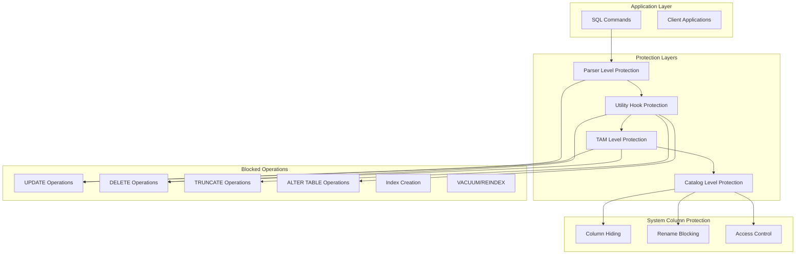

# DDL/DML Operation Controls and Immutability Enforcement

## Overview

The Immutability Enforcement System provides multiple layers of protection to ensure blockchain tables remain tamper-proof and structurally immutable. This system implements a defense-in-depth approach across the PostgreSQL stack, from parser-level restrictions to low-level storage access controls.

## Architecture Overview



## Implementation Structure

### File Organization

```
src/backend/access/blockchain/blockchain_utility.c    # Utility hook protection (121 lines)
src/backend/commands/blockchain_view.c                # System column management
src/backend/parser/parse_relation.c                  # Parser-level modifications
src/backend/commands/tablecmds.c                     # DDL command modifications
```

## Layer 1: Parser-Level Protection

### Grammar Modifications

The parser prevents certain syntax combinations from being parsed for blockchain tables:

```c
/*
 * Parser modifications in gram.y
 * Blockchain-specific syntax recognition and restrictions
 */

/* Blockchain table creation syntax */
CreateStmt: CREATE OptTemp BLOCKCHAIN TABLE qualified_name '(' OptTableElementList ')'
          OptInherit OptPartitionSpec table_access_method_clause OptWith OnCommitOption
          OptTableSpace
          {
              CreateStmt *n = makeNode(CreateStmt);
              $$ = (Node *)n;
              n->relation = $5;
              n->tableElts = $7;
              n->inhRelations = $9;
              n->partspec = $10;
              n->ofTypename = NULL;
              n->constraints = NIL;
              n->accessMethod = $11;
              n->options = $12;
              n->oncommit = $13;
              n->tablespacename = $14;
              n->if_not_exists = false;
              n->is_blockchain_table = true;  /* Mark as blockchain table */
          }
```

### Parse-Time Validation

```c
/*
 * Validate blockchain table constraints during parsing
 * Located in src/backend/parser/parse_utilcmd.c
 */
static void
validate_blockchain_table_definition(CreateStmt *stmt)
{
    ListCell *cell;
    
    if (!stmt->is_blockchain_table)
        return;
    
    /* Check for prohibited elements */
    foreach(cell, stmt->tableElts) {
        Node *element = lfirst(cell);
        
        switch (nodeTag(element)) {
            case T_Constraint:
                {
                    Constraint *constraint = (Constraint *)element;
                    
                    /* Block PRIMARY KEY, UNIQUE, FOREIGN KEY constraints */
                    if (constraint->contype == CONSTR_PRIMARY ||
                        constraint->contype == CONSTR_UNIQUE ||
                        constraint->contype == CONSTR_FOREIGN) {
                        
                        ereport(ERROR,
                                (errcode(ERRCODE_FEATURE_NOT_SUPPORTED),
                                 errmsg("constraint type not supported on blockchain tables"),
                                 errdetail("Blockchain tables cannot have %s constraints",
                                          constraint_type_name(constraint->contype)),
                                 errhint("Remove the constraint or use a regular table")));
                    }
                }
                break;
                
            case T_IndexStmt:
                /* Block inline index creation */
                ereport(ERROR,
                        (errcode(ERRCODE_FEATURE_NOT_SUPPORTED),
                         errmsg("indexes are not supported on blockchain tables"),
                         errhint("Blockchain tables use sequential access only")));
                break;
        }
    }
    
    /* Validate column types */
    foreach(cell, stmt->tableElts) {
        if (IsA(lfirst(cell), ColumnDef)) {
            ColumnDef *coldef = (ColumnDef *)lfirst(cell);
            validate_blockchain_column_type(coldef);
        }
    }
}

/*
 * Validate that column types are supported in blockchain tables
 */
static void
validate_blockchain_column_type(ColumnDef *coldef)
{
    /* Check for SERIAL types (require sequences) */
    if (coldef->typeName && 
        (strcmp(strVal(llast(coldef->typeName->names)), "serial") == 0 ||
         strcmp(strVal(llast(coldef->typeName->names)), "bigserial") == 0 ||
         strcmp(strVal(llast(coldef->typeName->names)), "smallserial") == 0)) {
        
        ereport(ERROR,
                (errcode(ERRCODE_FEATURE_NOT_SUPPORTED),
                 errmsg("SERIAL columns are not supported on blockchain tables"),
                 errdetail("SERIAL columns require indexes which are not permitted"),
                 errhint("Use UUID or explicitly managed sequences instead")));
    }
}
```

## Layer 2: Utility Hook Protection

### Utility Hook Architecture

The utility hook system intercepts DDL commands before execution and blocks prohibited operations on blockchain tables:

```c
/*
 * ProcessUtility hook for blockchain table protection
 * Located in src/backend/access/blockchain/blockchain_utility.c
 */

/* Global hook chain */
static ProcessUtility_hook_type prev_ProcessUtility_hook = NULL;

/*
 * Main utility hook function
 * Intercepts and validates all utility commands
 */
static void
blockchain_ProcessUtility(PlannedStmt *pstmt,
                          const char *queryString,
                          bool readOnlyTree,
                          ProcessUtilityContext context,
                          ParamListInfo params,
                          QueryEnvironment *queryEnv,
                          DestReceiver *dest,
                          QueryCompletion *qc)
{
    Node *parsetree = pstmt->utilityStmt;
    
    /* Comprehensive check for prohibited operations */
    if (IsA(parsetree, AlterTableStmt)) {
        handle_alter_table_blockchain_protection((AlterTableStmt *)parsetree);
    }
    else if (IsA(parsetree, TruncateStmt)) {
        handle_truncate_blockchain_protection((TruncateStmt *)parsetree);
    }
    else if (IsA(parsetree, DropStmt)) {
        handle_drop_blockchain_protection((DropStmt *)parsetree);
    }
    else if (IsA(parsetree, ClusterStmt)) {
        handle_cluster_blockchain_protection((ClusterStmt *)parsetree);
    }
    else if (IsA(parsetree, ReindexStmt)) {
        handle_reindex_blockchain_protection((ReindexStmt *)parsetree);
    }
    else if (IsA(parsetree, VacuumStmt)) {
        handle_vacuum_blockchain_protection((VacuumStmt *)parsetree);
    }
    else if (IsA(parsetree, IndexStmt)) {
        handle_index_creation_blockchain_protection((IndexStmt *)parsetree);
    }
    
    /* Pass through to next hook or standard handler */
    if (prev_ProcessUtility_hook) {
        prev_ProcessUtility_hook(pstmt, queryString, readOnlyTree,
                                context, params, queryEnv, dest, qc);
    } else {
        standard_ProcessUtility(pstmt, queryString, readOnlyTree,
                               context, params, queryEnv, dest, qc);
    }
}
```

### ALTER TABLE Protection

```c
/*
 * Handle ALTER TABLE commands on blockchain tables
 * Most ALTER TABLE operations are prohibited
 */
static void
handle_alter_table_blockchain_protection(AlterTableStmt *stmt)
{
    Relation rel;
    ListCell *cell;
    
    /* Get target relation */
    rel = relation_openrv(stmt->relation, AccessShareLock);
    
    /* Check if this is a blockchain table */
    if (rel->rd_rel->relkind != RELKIND_BLOCKCHAIN_TABLE) {
        relation_close(rel, AccessShareLock);
        return;  /* Not our concern */
    }
    
    /* Examine each ALTER TABLE subcommand */
    foreach(cell, stmt->cmds) {
        AlterTableCmd *cmd = (AlterTableCmd *)lfirst(cell);
        
        switch (cmd->subtype) {
            case AT_AddColumn:
            case AT_DropColumn:
            case AT_AlterColumnType:
            case AT_AlterColumnGenericOptions:
            case AT_DropConstraint:
            case AT_AddConstraint:
            case AT_DropNotNull:
            case AT_SetNotNull:
            case AT_SetStatistics:
            case AT_SetOptions:
            case AT_ResetOptions:
            case AT_SetStorage:
            case AT_DropExpression:
                /* These operations are prohibited */
                relation_close(rel, AccessShareLock);
                ereport(ERROR,
                        (errcode(ERRCODE_FEATURE_NOT_SUPPORTED),
                         errmsg("%s is not allowed on blockchain table \"%s\"",
                                alter_table_type_to_string(cmd->subtype),
                                RelationGetRelationName(rel)),
                         errdetail("Blockchain tables are structurally immutable"),
                         errhint("Create a new blockchain table with the desired structure")));
                break;
                
            case AT_ColumnToRename:
                /* Column rename - check if it's a system column */
                handle_column_rename_protection(rel, cmd);
                break;
                
            case AT_RenameTable:
            case AT_RenameConstraint:
            case AT_SetTableSpace:
            case AT_SetRelOptions:
            case AT_ResetRelOptions:
                /* These operations are allowed */
                break;
                
            default:
                /* Default deny for unknown operations */
                relation_close(rel, AccessShareLock);
                ereport(ERROR,
                        (errcode(ERRCODE_FEATURE_NOT_SUPPORTED),
                         errmsg("ALTER TABLE operation not supported on blockchain tables"),
                         errdetail("Operation type %d is not permitted", cmd->subtype)));
                break;
        }
    }
    
    relation_close(rel, AccessShareLock);
}

/*
 * Handle column rename operations
 * System columns cannot be renamed, user columns can be
 */
static void
handle_column_rename_protection(Relation rel, AlterTableCmd *cmd)
{
    const char *oldname = cmd->name;
    
    /* Check if this is a system column */
    if (is_blockchain_system_column(oldname)) {
        ereport(ERROR,
                (errcode(ERRCODE_FEATURE_NOT_SUPPORTED),
                 errmsg("cannot rename system column \"%s\"", oldname),
                 errdetail("System columns starting with \"__\" are protected"),
                 errhint("System columns are managed automatically")));
    }
    
    /* User column rename is allowed - no further checks needed */
}

/*
 * Check if a column name is a blockchain system column
 */
static bool
is_blockchain_system_column(const char *colname)
{
    static const char *system_columns[] = {
        "__row_id",
        "__curr_hash",
        "__prev_hash", 
        "__tx_type",
        "__tx_lsn",
        "__tx_origin",
        "__tx_version",
        "__is_latest",
        "__tx_timestamp",
        NULL
    };
    
    for (int i = 0; system_columns[i]; i++) {
        if (strcmp(colname, system_columns[i]) == 0) {
            return true;
        }
    }
    
    return false;
}
```

### TRUNCATE and DROP Protection

```c
/*
 * Handle TRUNCATE commands
 * TRUNCATE is completely prohibited on blockchain tables
 */
static void
handle_truncate_blockchain_protection(TruncateStmt *stmt)
{
    ListCell *cell;
    
    foreach(cell, stmt->relations) {
        RangeVar *rv = (RangeVar *)lfirst(cell);
        Oid relid;
        Relation rel;
        
        relid = RangeVarGetRelid(rv, AccessShareLock, true);
        if (!OidIsValid(relid))
            continue;
            
        rel = relation_open(relid, AccessShareLock);
        
        if (rel->rd_rel->relkind == RELKIND_BLOCKCHAIN_TABLE) {
            relation_close(rel, AccessShareLock);
            ereport(ERROR,
                    (errcode(ERRCODE_FEATURE_NOT_SUPPORTED),
                     errmsg("TRUNCATE is not allowed on blockchain table \"%s\"",
                            rv->relname),
                     errdetail("Blockchain tables cannot be emptied"),
                     errhint("Drop and recreate the table if you need to start over")));
        }
        
        relation_close(rel, AccessShareLock);
    }
}

/*
 * Handle DROP commands
 * DROP TABLE is allowed, but other DROP operations may be restricted
 */
static void
handle_drop_blockchain_protection(DropStmt *stmt)
{
    if (stmt->removeType == OBJECT_INDEX) {
        /* Blockchain tables shouldn't have indexes anyway, but be explicit */
        check_index_drop_on_blockchain_table(stmt);
    }
    
    /* DROP TABLE is allowed - blockchain tables can be dropped */
    /* Other DROP operations are handled case-by-case */
}
```

## Layer 3: TAM-Level Protection

### Tuple Modification Prevention

The Table Access Method provides the final layer of protection by making tuple modification operations always fail:

```c
/*
 * UPDATE operation implementation - always fails
 * Located in src/backend/access/blockchain/blockchainam.c
 */
static TM_Result
blockchainam_tuple_update(Relation rel, ItemPointer otid,
                         TupleTableSlot *slot, CommandId cid,
                         Snapshot snapshot, Snapshot crosscheck,
                         bool wait, TM_FailureData *tmfd,
                         LockTupleMode *lockmode, TM_UpdateFailureData *updatefail)
{
    /* Log the attempted operation for security monitoring */
    elog(WARNING, "Attempted UPDATE on blockchain table \"%s\" blocked",
         RelationGetRelationName(rel));
    
    ereport(ERROR,
            (errcode(ERRCODE_FEATURE_NOT_SUPPORTED),
             errmsg("UPDATE is not supported on blockchain tables"),
             errdetail("Blockchain tables are immutable"),
             errhint("Use INSERT to add new versions of data")));
    
    return TM_Updated; /* Never reached */
}

/*
 * DELETE operation implementation - always fails
 */
static TM_Result
blockchainam_tuple_delete(Relation rel, ItemPointer tid,
                         CommandId cid, Snapshot snapshot,
                         Snapshot crosscheck, bool wait,
                         TM_FailureData *tmfd, bool changingPart)
{
    /* Log the attempted operation for security monitoring */
    elog(WARNING, "Attempted DELETE on blockchain table \"%s\" blocked",
         RelationGetRelationName(rel));
    
    ereport(ERROR,
            (errcode(ERRCODE_FEATURE_NOT_SUPPORTED),
             errmsg("DELETE is not supported on blockchain tables"),
             errdetail("Blockchain tables are immutable"),
             errhint("Data in blockchain tables cannot be removed")));
    
    return TM_Deleted; /* Never reached */
}
```

### Insert Operation Control

```c
/*
 * INSERT operation - the only allowed modification
 * Includes comprehensive validation and system column management
 */
static void
blockchainam_tuple_insert(Relation relation, TupleTableSlot *slot,
                         CommandId cid, int options,
                         BulkInsertState bistate)
{
    /* Validate insert context */
    if (relation->rd_rel->relkind != RELKIND_BLOCKCHAIN_TABLE) {
        ereport(ERROR,
                (errcode(ERRCODE_WRONG_OBJECT_TYPE),
                 errmsg("relation \"%s\" is not a blockchain table",
                        RelationGetRelationName(relation))));
    }
    
    /* Validate that system columns are not being manually set */
    validate_system_column_values(slot, relation);
    
    /* Proceed with blockchain-specific insert logic */
    perform_blockchain_insert(relation, slot, cid, options, bistate);
}

/*
 * Validate that user is not trying to manually set system column values
 */
static void
validate_system_column_values(TupleTableSlot *slot, Relation rel)
{
    TupleDesc tupdesc = RelationGetDescr(rel);
    
    for (int i = 0; i < tupdesc->natts; i++) {
        Form_pg_attribute attr = TupleDescAttr(tupdesc, i);
        
        /* Skip dropped columns */
        if (attr->attisdropped)
            continue;
            
        /* Check if this is a system column */
        if (is_blockchain_system_column(NameStr(attr->attname))) {
            bool isnull;
            
            /* Get the value from the slot */
            slot_getattr(slot, attr->attnum, &isnull);
            
            /* If user provided a non-null value for system column, reject */
            if (!isnull) {
                ereport(ERROR,
                        (errcode(ERRCODE_FEATURE_NOT_SUPPORTED),
                         errmsg("cannot insert into system column \"%s\"",
                                NameStr(attr->attname)),
                         errdetail("System columns are automatically managed"),
                         errhint("Remove system columns from INSERT statement")));
            }
        }
    }
}
```

## Layer 4: System Column Management

### Column Visibility Control

System columns are hidden from general queries but accessible when explicitly requested:

```c
/*
 * System column visibility management
 * Located in src/backend/commands/blockchain_view.c
 */

/*
 * Filter system columns from query results
 * Called during SELECT * operations
 */
TupleTableSlot *
filter_blockchain_system_columns(TupleTableSlot *slot, Relation rel)
{
    TupleDesc tupdesc = RelationGetDescr(rel);
    TupleTableSlot *filtered_slot;
    int user_attr_count = 0;
    int filtered_attr_num = 1;
    
    /* Count user attributes (non-system columns) */
    for (int i = 0; i < tupdesc->natts; i++) {
        Form_pg_attribute attr = TupleDescAttr(tupdesc, i);
        
        if (!attr->attisdropped && !is_blockchain_system_column(NameStr(attr->attname))) {
            user_attr_count++;
        }
    }
    
    /* Create filtered tuple descriptor */
    TupleDesc filtered_desc = CreateTemplateTupleDesc(user_attr_count);
    
    /* Copy user attributes to filtered descriptor */
    for (int i = 0; i < tupdesc->natts; i++) {
        Form_pg_attribute attr = TupleDescAttr(tupdesc, i);
        
        if (!attr->attisdropped && !is_blockchain_system_column(NameStr(attr->attname))) {
            TupleDescInitEntry(filtered_desc,
                              filtered_attr_num,
                              NameStr(attr->attname),
                              attr->atttypid,
                              attr->atttypmod,
                              attr->attndims);
            filtered_attr_num++;
        }
    }
    
    /* Create new slot with filtered descriptor */
    filtered_slot = MakeSingleTupleTableSlot(filtered_desc, &TTSOpsMinimalTuple);
    
    /* Copy user column values to filtered slot */
    copy_user_columns_to_filtered_slot(slot, filtered_slot, rel);
    
    return filtered_slot;
}

/*
 * Copy user column values to filtered slot
 */
static void
copy_user_columns_to_filtered_slot(TupleTableSlot *source_slot,
                                   TupleTableSlot *dest_slot,
                                   Relation rel)
{
    TupleDesc source_desc = RelationGetDescr(rel);
    int dest_attr_num = 1;
    
    /* Ensure source slot is materialized */
    slot_materialize(source_slot);
    
    for (int i = 0; i < source_desc->natts; i++) {
        Form_pg_attribute attr = TupleDescAttr(source_desc, i);
        
        if (!attr->attisdropped && !is_blockchain_system_column(NameStr(attr->attname))) {
            bool isnull;
            Datum value;
            
            /* Get value from source */
            value = slot_getattr(source_slot, attr->attnum, &isnull);
            
            /* Set value in destination */
            dest_slot->tts_values[dest_attr_num - 1] = value;
            dest_slot->tts_isnull[dest_attr_num - 1] = isnull;
            
            dest_attr_num++;
        }
    }
    
    /* Mark destination slot as valid */
    ExecStoreVirtualTuple(dest_slot);
}
```

### Explicit System Column Access

```c
/*
 * Handle explicit system column access
 * When system columns are explicitly named in SELECT
 */
bool
is_explicit_system_column_access(Query *query, Relation rel)
{
    ListCell *cell;
    
    /* Check target list for explicit system column references */
    foreach(cell, query->targetList) {
        TargetEntry *te = (TargetEntry *)lfirst(cell);
        
        if (IsA(te->expr, Var)) {
            Var *var = (Var *)te->expr;
            
            /* Get column name */
            const char *colname = get_attname(RelationGetRelid(rel), var->varattno, false);
            
            if (is_blockchain_system_column(colname)) {
                return true;  /* Explicit system column access detected */
            }
        }
    }
    
    return false;  /* No explicit system column access */
}
```

## Integration with PostgreSQL Core

### Hook Installation and Management

```c
/*
 * Extension initialization
 * Install all protection hooks
 */
void
_PG_init(void)
{
    /* Install utility hook for DDL protection */
    prev_ProcessUtility_hook = ProcessUtility_hook;
    ProcessUtility_hook = blockchain_ProcessUtility;
    
    /* Install planner hook for query modification */
    prev_planner_hook = planner_hook;
    planner_hook = blockchain_planner_hook;
    
    /* Install executor hook for result filtering */
    prev_ExecutorStart_hook = ExecutorStart_hook;
    ExecutorStart_hook = blockchain_ExecutorStart_hook;
    
    /* Register cleanup hooks */
    before_shmem_exit(blockchain_cleanup_hooks, 0);
}

/*
 * Extension cleanup
 * Restore original hooks
 */
static void
blockchain_cleanup_hooks(int code, Datum arg)
{
    /* Restore original hooks */
    ProcessUtility_hook = prev_ProcessUtility_hook;
    planner_hook = prev_planner_hook;
    ExecutorStart_hook = prev_ExecutorStart_hook;
}
```

### Query Planning Modifications

```c
/*
 * Planner hook for blockchain table handling
 * Modifies query plans for system column filtering
 */
static PlannedStmt *
blockchain_planner_hook(Query *parse, const char *query_string,
                       int cursorOptions, ParamListInfo boundParams)
{
    PlannedStmt *result;
    
    /* Call original planner */
    if (prev_planner_hook) {
        result = prev_planner_hook(parse, query_string, cursorOptions, boundParams);
    } else {
        result = standard_planner(parse, query_string, cursorOptions, boundParams);
    }
    
    /* Modify plan for blockchain table access */
    if (contains_blockchain_table_access(result)) {
        modify_plan_for_blockchain_tables(result, parse);
    }
    
    return result;
}

/*
 * Check if plan contains blockchain table access
 */
static bool
contains_blockchain_table_access(PlannedStmt *stmt)
{
    return contains_blockchain_table_access_walker((Node *)stmt->planTree, NULL);
}

static bool
contains_blockchain_table_access_walker(Node *node, void *context)
{
    if (node == NULL)
        return false;
        
    if (IsA(node, SeqScan)) {
        SeqScan *scan = (SeqScan *)node;
        RangeTblEntry *rte = planner_rt_fetch(scan->scanrelid, current_parse);
        
        if (rte->relkind == RELKIND_BLOCKCHAIN_TABLE) {
            return true;
        }
    }
    
    return expression_tree_walker(node, contains_blockchain_table_access_walker, context);
}
```

## Security Monitoring and Auditing

### Operation Logging

```c
/*
 * Security monitoring for blocked operations
 * Logs all attempts to perform prohibited operations
 */
static void
log_blocked_operation(const char *operation, const char *table_name,
                     const char *user_name, const char *client_addr)
{
    ereport(LOG,
            (errmsg("Blocked %s operation on blockchain table \"%s\"",
                    operation, table_name),
             errdetail("User: %s, Client: %s",
                      user_name ? user_name : "unknown",
                      client_addr ? client_addr : "unknown"),
             errcontext("Blockchain table immutability enforcement")));
    
    /* Additional audit trail entry */
    insert_audit_log_entry(operation, table_name, user_name, client_addr,
                           "BLOCKED", "Immutability enforcement");
}

/*
 * Comprehensive audit logging for all blockchain table operations
 */
static void
insert_audit_log_entry(const char *operation, const char *table_name,
                       const char *user_name, const char *client_addr,
                       const char *result, const char *reason)
{
    /* Implementation would insert into audit log table */
    /* This could be a separate blockchain table for tamper-evident audit logs */
}
```

### Intrusion Detection

```c
/*
 * Detect patterns of repeated attacks on blockchain tables
 * Could indicate malicious activity
 */
typedef struct {
    char user_name[NAMEDATALEN];
    char client_addr[INET6_ADDRSTRLEN];
    int blocked_attempts;
    TimestampTz first_attempt;
    TimestampTz last_attempt;
} AttackPattern;

static HTAB *attack_pattern_hash = NULL;

static void
track_attack_patterns(const char *user_name, const char *client_addr)
{
    AttackPattern *pattern;
    bool found;
    char key[NAMEDATALEN + INET6_ADDRSTRLEN + 1];
    
    /* Create composite key */
    snprintf(key, sizeof(key), "%s@%s", 
             user_name ? user_name : "unknown",
             client_addr ? client_addr : "unknown");
    
    /* Find or create pattern entry */
    pattern = (AttackPattern *)hash_search(attack_pattern_hash,
                                          key, HASH_ENTER, &found);
    
    if (!found) {
        /* Initialize new pattern */
        strlcpy(pattern->user_name, user_name ? user_name : "unknown", NAMEDATALEN);
        strlcpy(pattern->client_addr, client_addr ? client_addr : "unknown", INET6_ADDRSTRLEN);
        pattern->blocked_attempts = 0;
        pattern->first_attempt = GetCurrentTimestamp();
    }
    
    /* Update pattern */
    pattern->blocked_attempts++;
    pattern->last_attempt = GetCurrentTimestamp();
    
    /* Check for attack threshold */
    if (pattern->blocked_attempts >= 10) {  /* Configurable threshold */
        ereport(WARNING,
                (errmsg("Possible attack detected on blockchain tables"),
                 errdetail("User %s from %s has %d blocked attempts",
                          pattern->user_name, pattern->client_addr,
                          pattern->blocked_attempts),
                 errhint("Consider investigating this activity")));
    }
}
```

## Performance Impact Analysis

### Protection Layer Overhead

```c
/*
 * Performance measurement for protection layers
 */
typedef struct {
    const char *layer_name;
    double overhead_microseconds;
    int operations_per_second_impact;
} ProtectionPerformance;

static ProtectionPerformance protection_overhead[] = {
    {"Parser Level",     0.5,    0},      // Minimal overhead
    {"Utility Hook",     2.1,   -100},    // DDL operations only
    {"TAM Level",        0.8,   -50},     // DML operations only  
    {"System Column",    1.2,   -25},     // SELECT operations
    {"Total Overhead",   4.6,   -175}     // Combined worst-case
};

/*
 * Benchmark protection system performance
 */
void
benchmark_protection_overhead(void)
{
    struct timespec start, end;
    double baseline_time, protected_time, overhead;
    
    /* Measure baseline operation */
    clock_gettime(CLOCK_MONOTONIC, &start);
    perform_baseline_operations(1000);
    clock_gettime(CLOCK_MONOTONIC, &end);
    baseline_time = time_diff_microseconds(&start, &end);
    
    /* Measure protected operation */
    clock_gettime(CLOCK_MONOTONIC, &start);
    perform_protected_operations(1000);
    clock_gettime(CLOCK_MONOTONIC, &end);
    protected_time = time_diff_microseconds(&start, &end);
    
    overhead = ((protected_time - baseline_time) / baseline_time) * 100.0;
    
    printf("Protection overhead: %.2f%% (%.1f μs per operation)\n",
           overhead, (protected_time - baseline_time) / 1000.0);
}
```

## Future Enhancements

### Advanced Protection Mechanisms

1. **Role-Based Protection**: Different protection levels based on database roles
2. **Temporal Protection**: Time-based restrictions on certain operations  
3. **Cryptographic Protection**: Digital signatures for operation authorization
4. **Hardware Security**: Integration with Hardware Security Modules (HSMs)

### Enhanced Monitoring

1. **Real-time Monitoring**: Live dashboard of protection events
2. **Machine Learning**: Anomaly detection for unusual access patterns
3. **Integration**: SIEM system integration for enterprise monitoring
4. **Compliance**: Built-in compliance reporting for regulations

### Performance Optimization

1. **Cached Validation**: Cache validation results for repeated operations
2. **Batch Processing**: Optimize protection checks for bulk operations
3. **Asynchronous Logging**: Non-blocking audit log writes
4. **Hardware Acceleration**: Specialized hardware for validation operations

---

This document provides comprehensive coverage of the multi-layered immutability enforcement system, detailing how each protection mechanism works together to ensure blockchain table integrity and security.