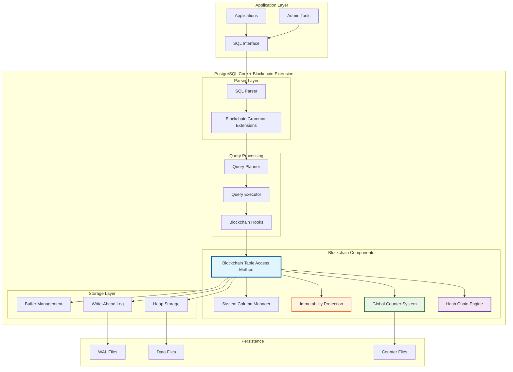
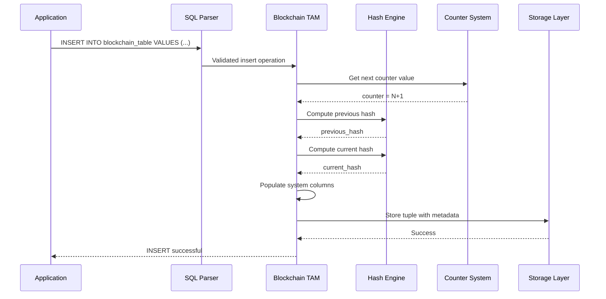
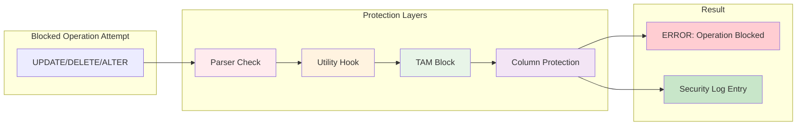
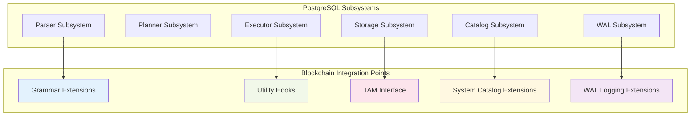
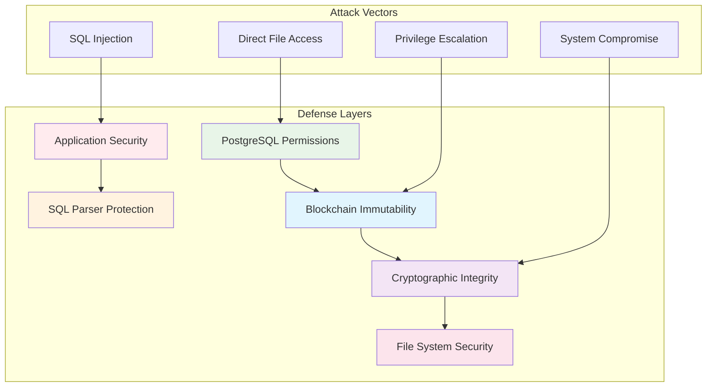

# Architecture Overview

The PostgreSQL Blockchain Extension implements a sophisticated multi-layered architecture that transforms PostgreSQL into a blockchain-enabled database system. This section provides comprehensive technical documentation of all architectural components.

## System Architecture

## Core Components

### 1. Blockchain Table Access Method (TAM)

The heart of the system that implements PostgreSQL's Table Access Method interface with blockchain-specific extensions.

-   **:material-database: Storage Engine**

    ---
    
    Custom table access method implementing all PostgreSQL TAM interfaces with immutability guarantees
    
    [:octicons-arrow-right-24: Learn more](blockchain-access-method.md)

-   **:material-table: System Columns**

    ---
    
    Automatic management of 9 blockchain metadata columns hidden from normal queries
    
    [:octicons-arrow-right-24: Details](blockchain-access-method.md#system-column-management)

**Key Features:**
- Full PostgreSQL TAM compliance
- Automatic system column injection
- Immutable tuple operations
- Seamless SQL integration

### 2. Hash Chain Engine

Cryptographic integrity system providing tamper-evident storage through SHA-256 hash chaining.

-   **:material-lock: Cryptographic Security**

    ---
    
    SHA-256 based hash chains linking every row to create tamper-evident storage
    
    [:octicons-arrow-right-24: Learn more](hash-chain-system.md)

-   **:material-link-variant: Chain Verification**

    ---
    
    Built-in verification mechanisms to detect any data tampering attempts
    
    [:octicons-arrow-right-24: Details](hash-chain-system.md#tamper-detection)

**Key Features:**
- SHA-256 cryptographic hashing
- Chain-based data linking
- Tamper detection capabilities
- Cross-platform consistency

### 3. Global Counter System

Sophisticated counter management providing unique sequential numbering across all blockchain tables.

-   **:material-counter: Unique Sequencing**

    ---
    
    Global counter system ensuring unique ordering across all blockchain operations
    
    [:octicons-arrow-right-24: Learn more](counter-management.md)

-   **:material-cached: Lazy Recovery**

    ---
    
    Intelligent recovery mechanism that eliminates startup delays while ensuring consistency
    
    [:octicons-arrow-right-24: Details](counter-management.md#lazy-recovery-mechanism)

**Key Features:**
- Shared memory architecture
- Lazy recovery mechanisms
- Atomic counter operations
- Persistent state management

### 4. Immutability Enforcement

Multi-layer protection system ensuring complete immutability through defense-in-depth approach.

-   **:material-shield-check: Multi-Layer Defense**

    ---
    
    Four-layer protection system preventing any data modification at every system level
    
    [:octicons-arrow-right-24: Learn more](immutability-enforcement.md)

-   **:material-security: Security Monitoring**

    ---
    
    Built-in monitoring and alerting for attempted security violations and attacks
    
    [:octicons-arrow-right-24: Details](immutability-enforcement.md#security-monitoring-and-auditing)

**Protection Layers:**
1. Parser-level syntax validation
2. Utility hook DDL interception
3. TAM-level operation blocking
4. System column access control

## Implementation Statistics

5,541
Lines of C Code

47
Implementation Commits

9
System Columns

4
Protection Layers

## Component Interactions

### Insert Operation Flow

### Protection Layer Activation

## Performance Characteristics

### Computational Overhead

| Component | Overhead | Impact |
|-----------|----------|---------|
| **Hash Computation** | ~2µs per operation | Cryptographic security |
| **Counter Increment** | <1µs per operation | Unique sequencing |
| **System Columns** | ~2µs per operation | Metadata management |
| **Protection Checks** | <0.5µs per operation | Immutability guarantee |
| **Total Insert Overhead** | ~5% vs regular table | Complete blockchain functionality |

### Memory Usage

| Component | Memory Usage | Scalability |
|-----------|--------------|-------------|
| **Shared Memory Base** | 4KB fixed | O(1) |
| **Per-Table Counters** | 128 bytes each | O(n) tables |
| **Hash Computation** | 64 bytes temporary | O(1) per operation |
| **System Columns** | 104 bytes per row | O(1) per row |

## Integration Points

### PostgreSQL Core Integration

The blockchain extension integrates at multiple PostgreSQL subsystem levels:

### Extension Architecture

The blockchain functionality is implemented as a PostgreSQL extension with the following structure:

- **Core Library**: Shared library loaded by PostgreSQL
- **SQL Functions**: User-accessible blockchain operations
- **System Hooks**: Deep integration with PostgreSQL internals
- **Configuration**: Runtime configuration parameters

## Security Architecture

### Threat Model

The system protects against various attack vectors:

| Threat Category | Protection Mechanism | Implementation |
|-----------------|---------------------|----------------|
| **Data Tampering** | Cryptographic hashing | SHA-256 chain verification |
| **Unauthorized Modifications** | Multi-layer blocking | Parser + hooks + TAM |
| **Schema Changes** | DDL protection | Utility hook interception |
| **Privilege Escalation** | Access control | PostgreSQL permission system |
| **Replay Attacks** | Temporal binding | Timestamp inclusion in hash |
| **Reordering Attacks** | Sequential binding | Counter inclusion in hash |

### Defense in Depth

## Development Timeline

The architecture evolved through several phases:

### Phase 1: Foundation (Commits 1-15)
- Basic parser integration and relkind support
- Initial table access method skeleton
- Core system catalog integration

### Phase 2: Core Features (Commits 16-30)
- SHA-256 hash engine implementation
- System column management
- Basic insert operation pipeline

### Phase 3: Counter System (Commits 31-40)
- Global counter architecture
- Shared memory implementation
- Persistence and recovery mechanisms

### Phase 4: Production Ready (Commits 41-47)
- Performance optimizations
- Comprehensive protection layers
- Complete system integration

## Future Architecture Considerations

### Scalability Enhancements
- Partitioned counter systems for high-throughput scenarios
- Compressed storage for system columns
- Optimized hash computation algorithms

### Security Improvements
- Hardware security module integration
- Zero-knowledge proof support
- Quantum-resistant cryptographic algorithms

### Integration Expansions
- External blockchain network bridges
- Consensus mechanism implementations
- Advanced replication protocols

---

This architecture documentation provides the foundation for understanding how all blockchain components work together to provide immutable, tamper-evident storage within PostgreSQL while maintaining full SQL compatibility and performance.