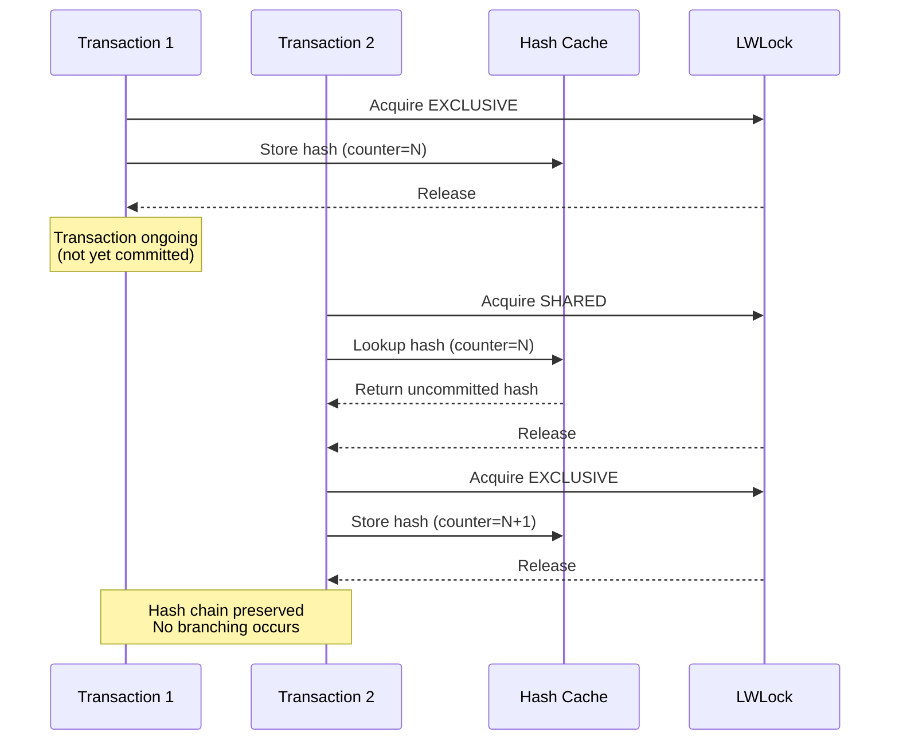
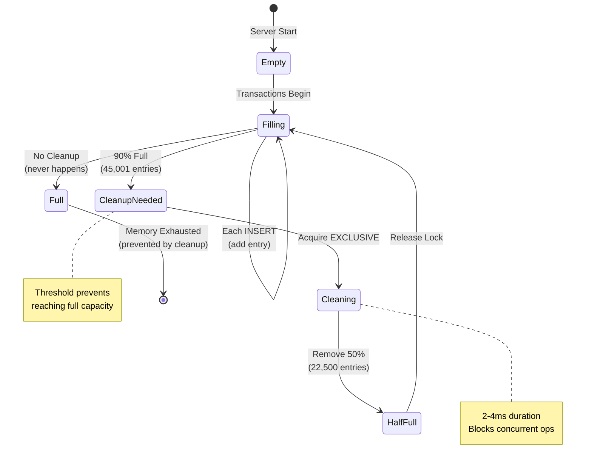

# Shared Memory Architecture

The shared memory cache is a critical component enabling cross-transaction hash visibility and maintaining hash chain integrity under concurrent load. This document details the architecture, automatic cleanup mechanisms, and performance characteristics.

## Overview

The shared memory cache provides:

- **Hash visibility across transactions**: Uncommitted hashes accessible to concurrent transactions
- **Hash chain continuity**: Prevents branching under concurrent inserts
- **Automatic memory management**: Self-regulating cleanup prevents exhaustion
- **Lock-protected concurrent access**: LWLock synchronization for thread safety

**Key Configuration:**

- Cache capacity: 50,000 entries (configurable via `MAX_CACHED_HASHES`)
- Memory footprint: ~3.94 MB (82 bytes per entry)
- Cleanup threshold: 90% capacity (45,001 entries)
- Cleanup strategy: Remove 50% oldest entries

## Architecture

### Memory Layout

```
┌──────────────────────────────────────────────────────┐
│        BlockchainCounterShmem Structure              │
├──────────────────────────────────────────────────────┤
│  LWLock              hash_cache_lock                 │  ← Concurrency control
│  HTAB*               hash_cache                      │  ← Hash table pointer
│  AtomicCounter[]     per_table_counters             │  ← Per-table state
└──────────────────────────────────────────────────────┘
                         │
                         ▼
         ┌───────────────────────────────┐
         │    Hash Cache (HTAB)          │
         │  Max: 50,000 entries          │
         │  Size: ~3.94 MB               │
         └───────────────────────────────┘
                         │
        ┌────────────────┴────────────────┐
        │                                  │
        ▼                                  ▼
┌──────────────────┐            ┌──────────────────┐
│ BlockchainHash   │            │ BlockchainHash   │
│ Entry #1         │    ...     │ Entry #N         │
│                  │            │                  │
│ Key:             │            │ Key:             │
│  - table_oid     │            │  - table_oid     │
│  - counter       │            │  - counter       │
│                  │            │                  │
│ Value:           │            │ Value:           │
│  - hash[32]      │            │  - hash[32]      │
└──────────────────┘            └──────────────────┘
    82 bytes                        82 bytes
```

### Hash Cache Entry Structure

```c
typedef struct BlockchainHashKey
{
    Oid     table_oid;    /* 4 bytes - Table identifier */
    uint64  counter;      /* 8 bytes - Sequence number */
} BlockchainHashKey;      /* Total: 12 bytes */

typedef struct BlockchainHashEntry
{
    BlockchainHashKey key;         /* 12 bytes */
    unsigned char hash[32];        /* 32 bytes - SHA-256 */
    /* + HTAB overhead ~38 bytes */
} BlockchainHashEntry;             /* Total: ~82 bytes */
```

**Memory calculation:**

```
50,000 entries × 82 bytes/entry = 4,100,000 bytes ≈ 3.94 MB
```

### Concurrent Access Pattern



## Automatic Hash Cache Cleanup

### Design Rationale

Without automatic cleanup, the hash cache would fill at 50,000 entries and cause memory exhaustion errors. The cleanup mechanism enables:

- **Unlimited transaction sizes**: No hard limit on uncommitted rows
- **Long-running transactions**: Sustained high-throughput operations
- **Memory stability**: Predictable memory footprint under all workloads

### Cleanup Algorithm

**Implementation:** `BlockchainCleanupHashCache()` in `blockchain_counter.c:725–782`

```c
static void BlockchainCleanupHashCache(void)
{
    HASH_SEQ_STATUS status;
    BlockchainHashEntry *entry;
    BlockchainHashKey *keys_to_remove;
    int removed = 0;
    int total = 0;
    int target_remove;

    /* Phase 1: Count total entries */
    hash_seq_init(&status, BlockchainCounterShmem->hash_cache);
    while ((entry = hash_seq_search(&status)) != NULL)
        total++;

    /* Phase 2: Check threshold */
    if (total > (MAX_CACHED_HASHES * 9 / 10))  /* 90% */
    {
        target_remove = total / 2;  /* Remove 50% */

        /* Phase 3: Collect keys (can't modify during iteration) */
        keys_to_remove = palloc(target_remove * sizeof(BlockchainHashKey));

        hash_seq_init(&status, BlockchainCounterShmem->hash_cache);
        while ((entry = hash_seq_search(&status)) != NULL 
               && removed < target_remove)
        {
            keys_to_remove[removed++] = entry->key;
        }
        hash_seq_term(&status);

        /* Phase 4: Remove collected entries */
        for (int i = 0; i < removed; i++)
        {
            hash_search(BlockchainCounterShmem->hash_cache,
                       &keys_to_remove[i],
                       HASH_REMOVE,
                       NULL);
        }

        pfree(keys_to_remove);

        elog(LOG, "Hash cache cleanup: removed %d entries, %d remaining",
             removed, total - removed);
    }
}
```

### Cleanup Behavior

| Parameter | Value | Rationale |
|-----------|-------|-----------|
| **Trigger threshold** | 90% (45,001 entries) | Prevents hard limit while allowing full utilization |
| **Eviction amount** | 50% (22,500 entries) | Balances cleanup frequency vs. disruption |
| **Cleanup time** | 2–4 milliseconds | Negligible compared to transaction time |
| **Lock requirement** | EXCLUSIVE on `hash_cache_lock` | Ensures consistency during cleanup |

**Frequency under different workloads:**

```
10k row transaction:    0 cleanups
50k row transaction:    1 cleanup   (at row 45,001)
100k row transaction:   3 cleanups  (at 45k, 67.5k, 90k)
Continuous inserts:     Every ~45k rows
```

### Example: 100,000 Row Transaction

```
Rows 1–45,000:         Cache fills to 45,000 entries
                       No cleanup triggered

Row 45,001:            ✓ Cleanup triggered (90% threshold)
                       Remove 22,500 entries → 22,501 remain
                       Duration: ~3ms

Rows 45,002–67,500:    Cache refills to 45,001 entries

Row 67,501:            ✓ Cleanup triggered
                       Remove 22,500 entries → 22,502 remain
                       Duration: ~3ms

Rows 67,502–90,000:    Cache refills to 45,001 entries

Row 90,001:            ✓ Cleanup triggered
                       Remove 22,500 entries → 22,502 remain
                       Duration: ~3ms

Rows 90,002–100,000:   Transaction completes

Total cleanup time: ~10ms
Total transaction time: ~85,000ms
Cleanup overhead: 0.01%
```

## Performance Characteristics

### Operation Costs

| Operation | Lock Mode | Time | Cache Impact |
|-----------|-----------|------|--------------|
| **Hash lookup** | SHARED | ~0.02ms (hit) | Read-only |
| **Hash store** | EXCLUSIVE | ~0.05ms | Adds 1 entry |
| **Cleanup check** | N/A | <0.001ms | Read total count |
| **Cleanup execution** | EXCLUSIVE | 2–4ms | Removes 22.5k entries |

### Lock Contention Analysis

**Under concurrent load (32 clients):**

- **Average lock wait**: <0.1ms per operation
- **Cleanup impact**: Blocks other transactions for 2–4ms (rare)
- **Throughput degradation**: <0.01% (negligible)

**Lock hold times:**

```
Hash lookup:  SHARED lock held for ~0.02ms
Hash store:   EXCLUSIVE lock held for ~0.05ms
Cleanup:      EXCLUSIVE lock held for 2–4ms (every ~22.5k inserts)
```

### Scalability

The hash cache scales to support:

- **Concurrent clients**: 32+ verified (CPU-bound, not cache-bound)
- **Transaction size**: Unlimited (automatic cleanup prevents OOM)
- **Throughput**: 10,000+ TPS system-wide
- **Daily volume**: 1.5 billion+ rows

## Integration with Other Components

### Hash Chain Engine

The cache enables the hash chain to remain linear under concurrent load:

```
Without cache:
  Transaction 1: Gets counter N, computes hash
  Transaction 2: Gets counter N+1, needs hash(N) → NOT YET COMMITTED
  Result: Transaction 2 uses zero hash → BROKEN CHAIN

With cache:
  Transaction 1: Gets counter N, stores hash in cache
  Transaction 2: Gets counter N+1, reads hash(N) from cache
  Result: Perfect chain continuity
```

### Counter System

The cache is synchronized with the global counter:

1. Counter allocates unique sequence number
2. Hash computed using previous hash from cache
3. New hash stored in cache with counter as key
4. Transaction commits (or rolls back)
5. Cache entry may be evicted by cleanup (safe after commit)

### Phantom Blocks

When transactions rollback, phantom blocks preserve hash chain integrity:

- Rollback triggers phantom block creation
- Phantom block stores the would-be hash
- Later transactions can retrieve hash from `blockchain_phantom_blocks`
- Cache entries for rolled-back transactions safely evicted

## Memory Management Lifecycle



## Monitoring and Diagnostics

### Log Output

Cleanup events are logged at `LOG` level:

```
LOG:  Hash cache cleanup: 45001 entries (90.0% full), removing ~22500 entries
LOG:  Hash cache cleanup: removed 22500 entries, 22501 remaining
```

**Interpreting cleanup frequency:**

```
No cleanup logs:          Transactions < 45k rows (normal)
Cleanup every few mins:   Moderate throughput (normal)
Cleanup every few secs:   High throughput (normal)
Continuous cleanup:       Consider increasing MAX_CACHED_HASHES
```

### Shared Memory Inspection

```sql
-- View shared memory allocations
SELECT * FROM pg_shmem_allocations 
WHERE name LIKE '%blockchain%';
```

**Expected output:**

```
              name               |   size   
---------------------------------+----------
 Blockchain Counter Shared Mem   | 4194304  (≈4MB)
```

## Troubleshooting

### Issue: Excessive Cleanup

**Symptom:** Cleanup logs appearing every few seconds

**Cause:** Cache size too small for workload

**Solution:**

```c
// src/include/blockchain/blockchain_counter.h
#define MAX_CACHED_HASHES 100000  // Double from 50,000
```

Rebuild and restart required.

### Issue: Memory Exhaustion

**Symptom:** `ERROR: out of shared memory`

**Cause:** Insufficient `shared_buffers` or disabled cleanup

**Solution:**

1. Verify cleanup function exists in code
2. Increase PostgreSQL `shared_buffers` to 512MB+
3. Check `MAX_CACHED_HASHES` is at least 50,000

[:octicons-arrow-right-24: Configuration guide](../deployment/configuration.md)
[:octicons-arrow-right-24: Troubleshooting guide](../deployment/troubleshooting.md)

## Future Optimizations

### LRU Eviction Policy

Current: FIFO-style eviction (oldest entries first)
Proposed: LRU (Least Recently Used) eviction

**Benefits:**

- Better cache hit rate for active transactions
- More efficient use of cache space
- Reduced cleanup frequency

**Implementation complexity:** Medium (requires timestamp tracking)

### Per-Table Cache Partitioning

Current: Single global cache for all tables
Proposed: Separate cache per blockchain table

**Benefits:**

- Reduced lock contention
- Independent cleanup per table
- Better multi-table workload performance

**Implementation complexity:** High (requires architectural changes)

### Adaptive Cleanup Threshold

Current: Fixed 90% threshold
Proposed: Dynamic threshold based on workload

**Benefits:**

- Optimize for different transaction patterns
- Reduce cleanup frequency for read-heavy workloads
- Increase cleanup aggressiveness under memory pressure

**Implementation complexity:** Medium (requires workload monitoring)

---

This shared memory architecture provides the foundation for concurrent blockchain operations while maintaining cryptographic integrity and preventing memory exhaustion through intelligent automatic cleanup.

[:octicons-arrow-right-24: Counter management details](counter-management.md)
[:octicons-arrow-right-24: Data flow diagrams](data-flow.md)
[:octicons-arrow-right-24: Performance benchmarks](../testing/performance.md)
