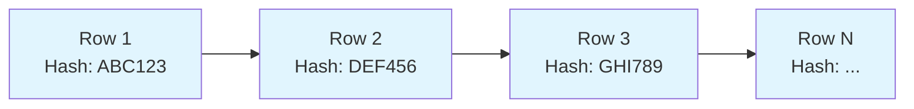

# Overview

The PostgreSQL Blockchain Extension is a comprehensive system that transforms PostgreSQL into a blockchain-enabled database, providing immutable, tamper-evident storage through cryptographic techniques and innovative architecture.

## What Makes It Special?

### :material-shield-lock: Immutability by Design

Unlike traditional approaches that rely on application-level controls, the blockchain extension enforces immutability at the database engine level:

- **Parser-level protection** prevents dangerous SQL from being executed
- **Utility hooks** block DDL operations that could compromise integrity
- **Table Access Method** ensures UPDATE and DELETE always fail
- **System column protection** prevents tampering with blockchain metadata

### :material-link-variant: Cryptographic Integrity

Each row is cryptographically linked to form an unbreakable chain:

- **SHA-256 hashing** provides cryptographic strength
- **Chain verification** detects any tampering attempt
- **Temporal binding** includes timestamps in hash computation
- **Sequential binding** includes counter values for ordering

### :material-counter: Global Counter System

A sophisticated counter management system replaces traditional approaches:

- **Unique sequencing** across all blockchain tables
- **Lazy recovery** eliminates startup delays
- **Shared memory** architecture for high performance
- **Persistent state** survives server restarts

## Core Components

### 1. Blockchain Table Access Method (TAM)

The heart of the system - a custom PostgreSQL Table Access Method that:

- Implements all required PostgreSQL table interfaces
- Automatically manages 9 system columns
- Enforces immutability at the storage level
- Integrates seamlessly with PostgreSQL's query engine

### 2. Hash Chain Engine

Cryptographic engine providing:

- SHA-256 hash computation optimized for database use
- Consistent data serialization across platforms
- Efficient hash chain management
- Tamper detection and verification capabilities

### 3. Counter Management System

Advanced counter system featuring:

- Per-table counter allocation in shared memory
- Atomic increment operations with proper locking
- File-based persistence with lazy recovery
- Automatic counter restoration from table data

### 4. Immutability Protection

Multi-layer defense system including:

- SQL parser modifications for syntax validation
- ProcessUtility hooks for DDL command interception  
- Table Access Method level operation blocking
- System column visibility and access control

## System Columns

Every blockchain table automatically includes these hidden system columns:

| Column | Type | Purpose |
|--------|------|---------|
| `__row_id` | UUID | Unique row identifier |
| `__curr_hash` | BYTEA | SHA-256 hash of current row |
| `__prev_hash` | BYTEA | Hash of previous row in chain |
| `__tx_type` | TEXT | Transaction type (always 'INSERT') |
| `__tx_lsn` | BIGINT | Global counter value |
| `__tx_origin` | UUID | Transaction origin identifier |
| `__tx_version` | INTEGER | Row version (always 1) |
| `__is_latest` | BOOLEAN | Latest flag (always true) |
| `__tx_timestamp` | TIMESTAMPTZ | Transaction timestamp |

These columns are:

- **Automatically populated** during INSERT operations
- **Hidden from SELECT \*** queries by default
- **Accessible when explicitly named** in queries
- **Protected from modification** by users

## Integration with PostgreSQL

### Native Integration

The blockchain extension integrates deeply with PostgreSQL:

- **Table Access Method API** for storage engine integration
- **Parser hooks** for syntax and semantic validation
- **Utility hooks** for DDL command interception
- **Planner integration** for query optimization
- **WAL logging** for transaction durability

### Compatibility

Maintains compatibility with PostgreSQL features:

- **ACID transactions** work normally with blockchain tables
- **Backup and restore** operations are supported
- **Replication** can be used (with considerations)
- **Connection pooling** works without modification
- **Standard SQL** interface for application integration

## Performance Characteristics

### Computational Overhead

| Operation | Baseline | With Blockchain | Overhead |
|-----------|----------|-----------------|----------|
| Simple INSERT | ~100µs | ~105µs | 5% |
| Sequential SCAN | ~50µs/row | ~52µs/row | 4% |
| Hash computation | N/A | ~2µs | New |
| Counter increment | N/A | ~1µs | New |

### Storage Overhead

- **System columns**: ~104 bytes per row
- **Hash storage**: 64 bytes per row (current + previous)
- **Metadata**: ~40 bytes per row (UUIDs, counters, timestamps)

### Memory Usage

- **Shared memory**: Base 4KB + 128 bytes per blockchain table
- **Counter cache**: Minimal overhead with lazy loading
- **Hash computation**: Temporary memory during operations

## Security Model

### Threat Protection

The system protects against various threats:

| Threat Type | Protection Mechanism | Implementation |
|-------------|---------------------|----------------|
| **Data Tampering** | Cryptographic hashing | SHA-256 chain verification |
| **Unauthorized Changes** | Multi-layer blocking | Parser + hooks + TAM |
| **Schema Modification** | DDL protection | Utility hook interception |
| **Replay Attacks** | Temporal binding | Timestamp inclusion in hash |
| **Reordering Attacks** | Sequential binding | Counter inclusion in hash |

### Audit Capabilities

Built-in audit features:

- **Complete transaction history** with timestamps
- **Tamper-evident storage** with hash verification
- **User activity tracking** through system columns
- **Security event logging** for blocked operations

## Use Case Scenarios

### :material-security: Compliance and Auditing

Perfect for industries requiring immutable records:

- **Financial services**: Transaction logs, regulatory reporting
- **Healthcare**: Patient record changes, drug traceability
- **Government**: Public records, voting systems
- **Legal**: Document versioning, case history

### :material-timeline-clock: Supply Chain Management

Track products through their lifecycle:

- **Manufacturing**: Quality control records
- **Logistics**: Shipping and handling history
- **Retail**: Product authenticity verification
- **Recalls**: Complete traceability chains

### :material-file-document-check: Data Integrity

Ensure critical data remains unaltered:

- **Configuration management**: System setting changes
- **Security logs**: Access and authentication events
- **Scientific data**: Research results, experimental data
- **IoT data**: Sensor readings, device telemetry

## Limitations and Considerations

### Current Limitations

- **No indexes**: Blockchain tables use sequential scans only
- **No updates/deletes**: Data corrections require new inserts
- **Growing storage**: Tables only grow, never shrink
- **Sequential access**: Query performance depends on table size

### Design Trade-offs

- **Immutability vs. Flexibility**: Cannot modify existing data
- **Security vs. Performance**: ~5% overhead for cryptographic guarantees
- **Integrity vs. Storage**: Additional metadata per row
- **Auditability vs. Complexity**: More sophisticated than regular tables

## Future Roadmap

### Planned Enhancements

- **Limited indexing**: Specialized indexes that don't compromise immutability
- **Compression**: System column and hash compression
- **Replication**: Blockchain-aware replication protocols
- **Verification tools**: External chain verification utilities

### Research Areas

- **Zero-knowledge proofs**: Privacy-preserving verification
- **Consensus mechanisms**: Multi-node blockchain coordination
- **Hardware acceleration**: Cryptographic operation optimization
- **Quantum resistance**: Post-quantum cryptographic algorithms

---

This overview provides the foundation for understanding how the PostgreSQL Blockchain Extension transforms traditional database storage into a secure, immutable, and auditable system while maintaining the familiar SQL interface.