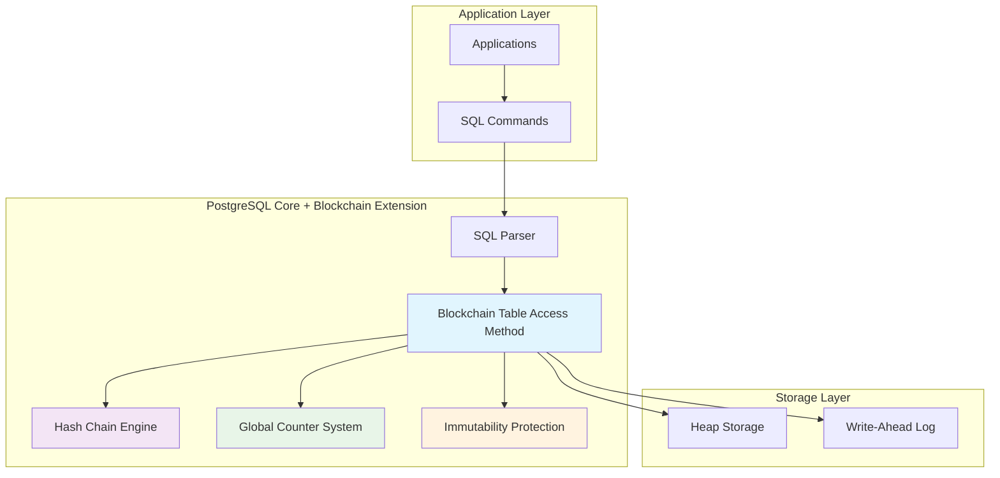

# PostgreSQL Blockchain Extension

Welcome to the comprehensive documentation for the **PostgreSQL Blockchain Extension** - a powerful system that adds immutable, tamper-evident storage capabilities to PostgreSQL through cryptographic hash chaining and global counter management.

<div class="grid cards" markdown>

-   :material-rocket-launch:{ .lg .middle } **Quick Start**

    ---

    Get up and running with blockchain tables in minutes

    [:octicons-arrow-right-24: Quick Start Guide](getting-started/quick-start.md)

-   :material-cogs:{ .lg .middle } **Architecture**

    ---

    Deep dive into the technical architecture and design

    [:octicons-arrow-right-24: System Architecture](architecture/)

-   :material-api:{ .lg .middle } **API Reference**

    ---

    Complete reference for C APIs and SQL functions

    [:octicons-arrow-right-24: API Documentation](api/)

-   :material-account-group:{ .lg .middle } **Contributing**

    ---

    Join the development community and contribute

    [:octicons-arrow-right-24: Contributing Guide](development/contributing.md)

</div>

## What is the PostgreSQL Blockchain Extension?

The PostgreSQL Blockchain Extension transforms PostgreSQL into a blockchain-enabled database system, providing:

!!! success "Key Features"
    
    - **:lock: Immutable Storage**: Once data is inserted, it cannot be modified or deleted
    - **:link: Cryptographic Integrity**: SHA-256 hash chains ensure tamper detection
    - **:1234: Sequential Ordering**: Global counter system provides unique sequencing
    - **:eye: Transparent Access**: Standard SQL interface with automatic system columns
    - **:shield: Multi-layer Protection**: Defense-in-depth security architecture

## Use Cases

<div class="grid cards" markdown>

-   :material-security:{ .lg .middle } **Audit Logging**

    ---

    Immutable audit trails for compliance and forensics

-   :material-bank:{ .lg .middle } **Financial Records**

    ---

    Tamper-proof financial transaction history

-   :material-file-document-check:{ .lg .middle } **Compliance**

    ---

    Regulatory data that must never be modified

-   :material-timeline-clock:{ .lg .middle } **Supply Chain**

    ---

    Track product journey without alterations

</div>

## Architecture Overview



## Quick Example

Here's how easy it is to create and use a blockchain table:

```sql title="Creating a Blockchain Table"
-- Create an immutable audit log
CREATE BLOCKCHAIN TABLE audit_log (
    user_id INTEGER,
    action VARCHAR(200),
    ip_address INET,
    timestamp TIMESTAMP DEFAULT CURRENT_TIMESTAMP
);

-- Insert data (only operation allowed)
INSERT INTO audit_log (user_id, action, ip_address) 
VALUES (1001, 'login', '192.168.1.100');

-- Query data (system columns are hidden by default)
SELECT * FROM audit_log;
```

```sql title="Accessing System Columns"
-- View blockchain metadata explicitly
SELECT user_id, action, __tx_lsn, __curr_hash, __tx_timestamp 
FROM audit_log;

-- Verify chain integrity
SELECT * FROM verify_hash_chain('audit_log');
```

!!! warning "Immutability Guarantee"
    
    Once created, blockchain tables **cannot** be modified:
    
    - `UPDATE` operations are blocked
    - `DELETE` operations are blocked  
    - `TRUNCATE` operations are blocked
    - Schema changes (`ALTER TABLE`) are restricted

## Implementation Statistics

Based on comprehensive analysis of the blockchain extension implementation:

<div class="grid" markdown>

<div class="admonition info" markdown>
<p class="admonition-title">Implementation Scale</p>

- **47 commits** implementing blockchain functionality
- **5,541 lines** of core C implementation code
- **9 system columns** automatically managed
- **4 protection layers** ensuring immutability

</div>

<div class="admonition success" markdown>
<p class="admonition-title">Performance Impact</p>

- **5% overhead** for INSERT operations
- **~2µs** for hash computation per row
- **<1µs** for counter increment
- **104 bytes** storage overhead per row

</div>

</div>

## System Components

### :material-database: Blockchain Table Access Method
Core storage engine that implements immutable table operations with automatic system column management.

### :material-link-variant: Hash Chain Engine  
SHA-256 cryptographic system that links each row to the previous one, creating tamper-evident chains.

### :material-counter: Global Counter System
Unique sequential numbering across all blockchain tables with persistent recovery mechanisms.

### :material-shield-lock: Immutability Enforcement
Multi-layer protection system preventing any data modification through parser, utility hooks, and storage controls.

## Getting Started Paths

Choose your path based on your role:

=== "Database User"

    **I want to use blockchain tables in my application**
    
    1. [:octicons-arrow-right-24: Quick Start Guide](getting-started/quick-start.md)
    2. [:octicons-arrow-right-24: User Guide](user-guide/)
    3. [:octicons-arrow-right-24: SQL Functions Reference](api/sql-functions-reference.md)
    
=== "Developer"

    **I want to contribute to or extend the blockchain functionality**
    
    1. [:octicons-arrow-right-24: Architecture Overview](architecture/)
    2. [:octicons-arrow-right-24: C API Reference](api/c-api-reference.md)
    3. [:octicons-arrow-right-24: Contributing Guide](development/contributing.md)

=== "System Administrator"

    **I want to deploy and manage blockchain tables**
    
    1. [:octicons-arrow-right-24: Installation Guide](deployment/installation.md)
    2. [:octicons-arrow-right-24: Configuration Guide](deployment/configuration.md)
    3. [:octicons-arrow-right-24: Monitoring Guide](deployment/monitoring.md)

=== "Architect"

    **I want to understand the technical architecture**
    
    1. [:octicons-arrow-right-24: High-Level Design](HLD_PostgreSQL_Blockchain_Extension.md)
    2. [:octicons-arrow-right-24: Architecture Deep Dive](architecture/)
    3. [:octicons-arrow-right-24: Performance Benchmarks](reference/performance.md)

## Community and Support

<div class="grid cards" markdown>

-   :material-github:{ .lg .middle } **GitHub**

    ---

    Source code, issues, and discussions

    [:octicons-arrow-right-24: View on GitHub](https://github.com/UltraMoonEagle/postgres_test)

-   :material-forum:{ .lg .middle } **Discussions**

    ---

    Ask questions and share ideas

    [:octicons-arrow-right-24: Join Discussions](https://github.com/UltraMoonEagle/postgres_test/discussions)

-   :material-bug:{ .lg .middle } **Issues**

    ---

    Report bugs and request features

    [:octicons-arrow-right-24: Report Issues](https://github.com/UltraMoonEagle/postgres_test/issues)

-   :material-email:{ .lg .middle } **Contact**

    ---

    Get in touch with the team

    [:octicons-arrow-right-24: Contact Us](mailto:contact@example.com)

</div>

---

*The PostgreSQL Blockchain Extension brings enterprise-grade immutable storage to PostgreSQL, enabling audit-grade data integrity with the familiar SQL interface you already know.*