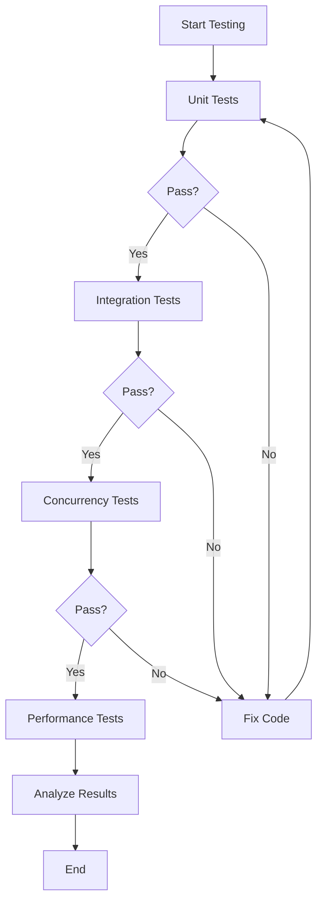

# Testing Overview

## One-Minute Summary

The PostgreSQL Blockchain Extension provides a comprehensive testing framework covering:
- **Unit tests**: Individual component validation (hash computation, counter management)
- **Integration tests**: End-to-end functionality verification (table creation, insertion, validation)
- **Concurrency tests**: Multi-client stress testing using pgbench
- **Performance tests**: Throughput and latency benchmarks

All tests verify the core blockchain properties: **immutability**, **hash chain integrity**, and **deterministic ordering**.

## Test Categories

| Test Type | Purpose | Duration | Tools |
|-----------|---------|----------|-------|
| Unit Tests | Component validation | < 1 min | SQL scripts |
| Integration Tests | Full workflow validation | 2-5 min | SQL scripts |
| Concurrency Tests | Race condition detection | 5-10 min | pgbench |
| Performance Tests | Throughput benchmarks | 10-30 min | pgbench, custom scripts |

## Quick Start

```bash
# Run comprehensive test suite
psql -d your_database -f /path/to/blockchain_comprehensive_tests.sql

# Run concurrency test
pgbench -c 10 -j 4 -t 100 -f pgbench_concurrent_test.sql your_database

# Verify hash chain integrity
psql -d your_database -c "SELECT verify_blockchain_table('your_blockchain_table');"
```

## Test Files Location

```
postgres_test/
├── blockchain_comprehensive_tests.sql    # Main test suite
├── pgbench_concurrent_test.sql          # Concurrency test script
├── query_anchor_test.sql                # Query anchoring tests
└── docs/testing/                         # This documentation
    ├── index.md                          # Overview (this file)
    ├── unit-tests.md                     # Unit test guide
    ├── integration-tests.md              # Integration test guide
    ├── concurrency-tests.md              # Concurrency test guide
    └── performance.md                    # Performance benchmarks
```

## Test Coverage

### Functional Coverage
- [x] Table creation with `CREATE BLOCKCHAIN TABLE`
- [x] Row insertion with automatic hash chain linking
- [x] System column generation and hiding
- [x] Global counter atomicity and persistence
- [x] Hash chain integrity verification
- [x] Query result anchoring (patent feature)
- [x] Immutability enforcement (UPDATE/DELETE/TRUNCATE blocked)
- [x] DDL restrictions (ALTER/DROP/INDEX blocked)

### Concurrency Coverage
- [x] Multi-client concurrent inserts
- [x] Hash chain linearization (no branching)
- [x] Counter sequence integrity
- [x] Race condition detection
- [x] Shared memory cache correctness

### Performance Coverage
- [x] Insertion throughput (TPS)
- [x] Hash computation overhead
- [x] Counter acquisition latency
- [x] Query anchoring performance
- [x] Scalability with table size

## Expected Test Results

### Comprehensive Test Suite
```
Total Sections: 11
Expected Passes: ~40 tests
Expected Failures: 10 (immutability violations - expected)
Duration: 2-5 minutes
```

### Concurrency Test (10 clients, 100 txns each)
```
Total Transactions: 1000
Expected TPS: 500-1000
Hash Chain Integrity: 100% (0 breaks)
Genesis Blocks: 1
Fork Points: 0
```

## Testing Workflow



## Prerequisites

### Database Setup
```sql
-- Ensure PostgreSQL instance is running with blockchain extension
CREATE EXTENSION IF NOT EXISTS blockchain_anchor;

-- Verify extension is loaded
SELECT * FROM pg_extension WHERE extname = 'blockchain_anchor';
```

### Tools Required
- PostgreSQL 14+ with blockchain extension compiled
- psql (PostgreSQL client)
- pgbench (included with PostgreSQL)
- Optional: Python 3.7+ for analysis scripts

## Test Data

### Sample Blockchain Table
```sql
CREATE BLOCKCHAIN TABLE audit_log (
    user_id INTEGER,
    username VARCHAR(50),
    action VARCHAR(200),
    ip_address INET,
    created_at TIMESTAMP DEFAULT CURRENT_TIMESTAMP
);

-- Insert test data
INSERT INTO audit_log (user_id, username, action, ip_address) VALUES
    (1, 'alice', 'login', '192.168.1.100'),
    (2, 'bob', 'create_account', '192.168.1.101'),
    (3, 'charlie', 'update_profile', '192.168.1.102');
```

## Validation Queries

### Hash Chain Integrity
```sql
-- Check for breaks in hash chain
WITH chain_check AS (
    SELECT
        __tx_lsn,
        __curr_hash,
        __prev_hash,
        LAG(__curr_hash) OVER (ORDER BY __tx_lsn) AS expected_prev_hash
    FROM audit_log
)
SELECT
    COUNT(*) FILTER (WHERE __prev_hash != expected_prev_hash AND __tx_lsn > 1) AS broken_links,
    COUNT(*) AS total_blocks,
    COUNT(DISTINCT CASE WHEN __prev_hash = '\x0000000000000000000000000000000000000000000000000000000000000000' THEN __tx_lsn END) AS genesis_count
FROM chain_check;

-- Expected: broken_links=0, genesis_count=1
```

### Counter Sequence
```sql
-- Verify counter monotonicity
SELECT
    MIN(__tx_lsn) AS first_counter,
    MAX(__tx_lsn) AS last_counter,
    COUNT(*) AS row_count,
    COUNT(DISTINCT __tx_lsn) AS unique_counters,
    CASE
        WHEN COUNT(*) = COUNT(DISTINCT __tx_lsn) THEN 'PASS: All unique'
        ELSE 'FAIL: Duplicate counters'
    END AS result
FROM audit_log;
```

## Troubleshooting

### Test Failures

#### "Hash chain broken" errors
**Symptom**: Verification reports broken links
**Cause**: Concurrent insert race condition
**Fix**: Ensure retry loop is enabled in `get_previous_hash()`

#### "Duplicate counter" errors
**Symptom**: Multiple rows with same `__tx_lsn`
**Cause**: Counter synchronization failure
**Fix**: Check shared memory initialization

#### Performance degradation
**Symptom**: TPS below 100
**Cause**: Disk I/O bottleneck or lock contention
**Fix**: Check `shared_buffers`, `work_mem` settings

### Common Issues

| Issue | Symptom | Solution |
|-------|---------|----------|
| Extension not loaded | `function anchor_query_result() does not exist` | `CREATE EXTENSION blockchain_anchor;` |
| Insufficient permissions | `permission denied for table` | `GRANT ALL ON TABLE to user;` |
| Shared memory full | `out of shared memory` | Increase `shared_buffers` |
| Lock timeout | `canceling statement due to lock timeout` | Increase `lock_timeout` |

## Best Practices

### Test Environment
1. **Isolated database**: Use dedicated test database
2. **Clean slate**: Drop/recreate tables between major test runs
3. **Resource allocation**: Ensure sufficient memory and CPU
4. **Monitoring**: Enable query logging for debugging

### Test Execution
1. **Sequential first**: Run unit and integration tests before concurrency
2. **Baseline**: Establish performance baseline before changes
3. **Reproducibility**: Use fixed seeds for random data generation
4. **Documentation**: Log test parameters and results

### Continuous Integration
```yaml
# Example CI pipeline
test:
  script:
    - make install
    - make installcheck
    - psql -f blockchain_comprehensive_tests.sql
    - pgbench -c 10 -t 100 -f pgbench_concurrent_test.sql
  artifacts:
    paths:
      - test_results/
```

## Performance Baselines

### Reference System
- CPU: 4 cores @ 2.5 GHz
- RAM: 16 GB
- Disk: SSD (500 MB/s sequential write)
- PostgreSQL 14.5 with default configuration

### Expected Performance
| Test | Metric | Expected Value |
|------|--------|----------------|
| Single insert | Latency | < 5ms |
| Bulk insert (1000 rows) | Throughput | > 500 TPS |
| Hash verification | Duration | < 1ms per row |
| Query anchoring | Overhead | < 10ms |
| Concurrent inserts (10 clients) | TPS | 500-1000 |

## Next Steps

1. **Unit Tests**: See [unit-tests.md](unit-tests.md) for component-level testing
2. **Integration Tests**: See [integration-tests.md](integration-tests.md) for workflow testing
3. **Concurrency Tests**: See [concurrency-tests.md](concurrency-tests.md) for stress testing
4. **Performance**: See [performance.md](performance.md) for benchmarking guide

## Additional Resources

- [PostgreSQL Testing Documentation](https://www.postgresql.org/docs/current/regress.html)
- [pgbench Manual](https://www.postgresql.org/docs/current/pgbench.html)
- [Blockchain Extension Architecture](../architecture/index.md)
- [API Reference](../api/index.md)
